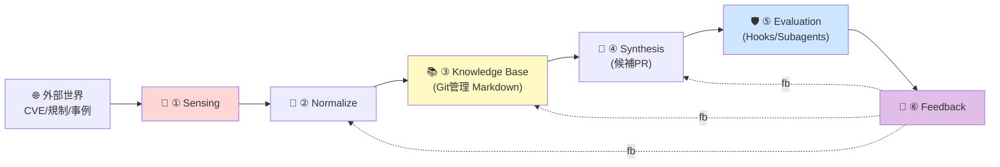

# Architecture

> 🚧 **Phase B で詳細を充填予定**。本ファイルは概要のみ。

## 全体像

Agentic Quality Gate は、**6 層の自動進化エンジン**と、ソフトウェアライフサイクルの **7 + 1 フェーズゲート** を組み合わせた品質保証基盤です。

## 4 設計原理

| 原理 | 一言 |
|---|---|
| 📜 Living Spec | ルール = コード。Git 管理。 |
| 👥 Dual-Use | AI 評価ルール + 人間チェックリスト = 単一ソース。 |
| 🔁 Auto-Update | 外部信号 → 24h で候補 PR。 |
| 🔐 Human-in-Loop | critical / 法務 / 認可は人間承認必須。 |

## 7 + 1 フェーズゲート

| フェーズ | 観点 | 主要ゲート例 |
|---|---|---|
| P0 構想 | 法務/コスト/脅威 | STRIDE / LINDDUN, ToS, 個情, ライセンス, コスト試算 |
| P1 アーキ | データ/認可/SLO | レイヤ選定, データモデル, 冪等性, テナント分離 |
| P2 実装 | Secret/IDOR/依存 | シークレット, IDOR, 入力検証, 依存実在確認 |
| P3 テスト | 観点/負荷 | 観点洗出し, モック濫用回避, 負荷, LLM 回帰 |
| P4 ステージ | 本番相当 | PII 疑似化, リストア演習, 観測疎通 |
| P5 リリース | カナリア/RB | カナリア, Feature Flag, ロールバック, ランブック |
| P6 運用 | 監視/コスト/学習 | アラート設計, コストトレンド, DR 演習, RCA |
| Cross-cutting | LLM/コンプラ | プロンプト注入, RAG 信頼境界, 個情法対応 等 |

## 詳細設計書（予定）

- `architecture-detailed.md` — 6 層の詳細仕様
- `phase-gates.md` — 各フェーズの全 137 ナレッジ ID
- `quickstart.md` — 6 週間 MVP の進め方
- `claude-code-mapping.md` — Claude Code プリミティブとのマッピング
