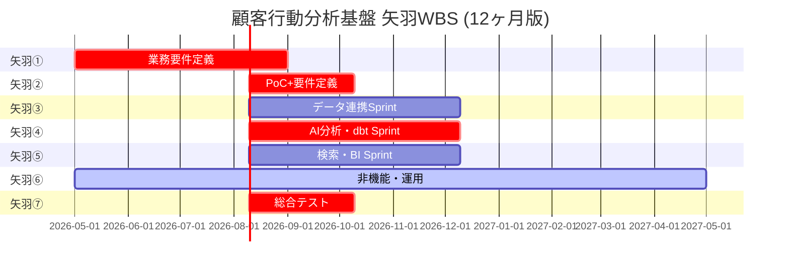

# pm-blueprint サンプル適用例

架空の小売業「株式会社サンプル商事」を例に、pm-blueprint の適用フローを示す。

---

## 想定 RFP

```
プロジェクト名: 顧客行動分析基盤構築

背景:
当社 (年商 200 億円の中堅小売業) は現在、購買データ・会員データ・Web 行動データが
サイロ化しており、経営判断や販促施策に活用できていない。データを統合し、
ダッシュボードで KPI を可視化したい。

要件概要:
- データソース: POS、会員DB、EC サイト、店舗 Wi-Fi
- 利用者: 経営層 (5 名)、マーケ部 (15 名)、店舗運営 (30 名)
- 主な機能: KPI ダッシュボード、アドホック分析、月次レポート自動生成
- 期間: 12ヶ月
- 予算: 1.2 億円
- 非機能: 99% 以上の可用性、個人情報保護法準拠

提案依頼事項:
- 全体アーキテクチャ
- 矢羽パターンの WBS
- リスク
- 体制
```

---

## ステップ 1: ディスカバリー (Layer 2) の出力サンプル

### JTBD (Jobs to be Done)

| アクター | ジョブ |
|---------|-------|
| 経営層 | 月次経営会議前に業績異常を早期察知したい (意思決定タイミングを逃したくない) |
| マーケ部 | キャンペーン企画時に類似セグメントの過去反応を確認したい (仮説検証速度UP) |
| 店舗運営 | 朝礼前に昨日の店舗 KPI を一目で確認したい (スタッフへの目標共有) |

### ステークホルダーマップ (抜粋)

| ステークホルダー | 象限 |
|----------------|------|
| CEO | 満足させる |
| マーケ部長 | 密接に管理 |
| 情シス部長 | 密接に管理 |
| 店長 (現場) | 情報共有 |
| 法務 | 満足させる |

### OST 優先解決策 Top 3

1. Lakehouse 基盤 + dbt + BI ツールによる統合分析基盤
2. LLM による自由記述アンケート要約
3. Text2SQL による非エンジニア向けセルフサービス

---

## ステップ 2: 前提抽出 の出力サンプル

### 不確実性マトリクス (最優先検証)

| 前提 | 軸 | 影響度 | 不確実性 |
|------|---|-------|---------|
| [仮定] POS API で日次データ取得可能 | Feasibility | 高 | 高 |
| [仮定] マーケ部は BI ツールを使いこなせる | Usability | 高 | 中 |
| [仮定] 12ヶ月で全ソース統合可能 | Feasibility | 高 | 高 |

### 検証計画

- 検証 1: POS ベンダーへの API 仕様書入手 (矢羽① 2 週目)
- 検証 2: マーケ部 3 名インタビュー (矢羽① 3 週目)
- 検証 3: PoC で 2 ソース統合 (矢羽② 前半)

---

## ステップ 3: ADR 主要 3 件サンプル

### ADR-0001: DWH プラットフォーム
- **決定**: Databricks (AWS)
- **代替案**: Snowflake, BigQuery, Redshift
- **可逆性**: Type 1

### ADR-0002: データ変換層
- **決定**: dbt-core on Databricks
- **代替案**: Airflow+SQL, DLT, Dataform
- **可逆性**: Type 2 寄り

### ADR-0003: LLM プラットフォーム
- **決定**: Azure OpenAI (GPT-4o) + LangChain 抽象化
- **代替案**: OpenAI 直接, Bedrock, オンプレ
- **可逆性**: Type 2

---

## ステップ 4: 要件定義 の出力サンプル

### ユースケース一覧 (抜粋)

| ID | タイトル | 優先度 |
|----|---------|-------|
| UC-001 | 経営層向け KPI ダッシュボード閲覧 | Must |
| UC-002 | マーケ部セグメント抽出 | Must |
| UC-003 | 店舗運営 日次 KPI 確認 | Should |
| UC-004 | 月次レポート自動生成 | Should |
| UC-005 | Text2SQL アドホック分析 | Could |

### NFR ランディングゾーン (抜粋)

| NFR ID | 内容 | 最小 | 目標 | 卓越 |
|--------|------|------|------|------|
| NFR-001 | BI 応答 P95 | 10 秒 | 3 秒 | 1 秒 |
| NFR-005 | 可用性 (業務時間帯) | 98% | 99.5% | 99.9% |
| NFR-010 | 認証 | SSO | SSO+MFA | SSO+MFA+PAM |

### EARS 要件例

- 「ユーザーがダッシュボードにアクセスした時、システムは Entra ID 認証を要求すること」(Event-driven)
- 「PII を含むデータが CSV 出力される場合、システムは該当カラムをマスキングすること」(Unwanted behavior)

---

## ステップ 5: リスク洗い出しの出力サンプル

### リスクレジスタ Top 5

| ID | タイトル | 確率/影響 | Kill基準 |
|----|---------|----------|---------|
| R001 | POS スキーマ変更 | 中/重大 | 月 3 回超 & 成功率 <90% |
| R002 | Azure OpenAI コスト超過 | 中/重大 | 月 150% 超 3ヶ月連続 |
| R003 | PII 漏洩 | 低/致命的 | インシデント発生時即停止 |
| R004 | 矢羽③遅延 | 中/重大 | 完了予定から 1ヶ月超遅延 |
| R005 | dbt 経験者確保困難 | 中/重大 | 矢羽②開始時 50% 未満 |

### STRIDE 脅威モデル (抜粋)

- **Spoofing**: サービスアカウント資格漏洩 → Key Vault管理、短命トークン
- **Information disclosure**: RLS ミスで PII 漏洩 → 多層防御、監査

---

## ステップ 6: 投資判断書サンプル

### エグゼクティブサマリー

- **投資額**: 初期 1.2 億円 + 運用 3500 万円/年
- **期待効果 (3 年累計)**: +1.0 億円 (分析工数削減 + 機会創出)
- **推奨**: 条件付き Go
  - 条件 A: 矢羽①完了時に業務部門承認必須
  - 条件 B: 矢羽②PoC で主要 3 ユースケース実現確認

### シナリオ別期待値

| シナリオ | 確率 | 3 年純効果 |
|---------|-----|----------|
| 楽観 | 20% | +1.8 億円 |
| 現実 | 60% | +0.8 億円 |
| 悲観 | 20% | -0.5 億円 |
| **期待値** | - | **+0.78 億円** |

---

## ステップ 7: 矢羽WBS の出力サンプル

### 全体 Gantt (Mermaid)



### 工数サマリー

- 総工数: **34 人月** (12ヶ月版、1.2 億円予算に合わせて矢羽スケールダウン)
- チーム: 6 名 (PM 1 + アーキ 1 + データエンジ 2 + BI 1 + 運用 1)
- 外部パートナー: 10 人月分

### 主要マイルストーン

- M1 (2026-08): 業務要件定義完了
- M2 (2026-10): PoC 完了、アーキ確定
- M3 (2027-01): Sprint 中間レビュー
- M4 (2027-02): Sprint 完了
- M5 (2027-04): UAT 合格
- M6 (2027-05): パイロットリリース

---

## 最終プロジェクト計画書のアウトライン

```
# 顧客行動分析基盤 プロジェクト計画書

1. エグゼクティブサマリー
2. プロジェクト憲章
3. 前提と仮説
   - JTBD
   - 4 軸前提リスト
   - 不確実性マトリクス
4. アーキテクチャ概要
   - C1 Context 図
   - C2 Container 図
   - ADR 0001〜0003 サマリー
   - コンテキストマップ (4 境界づけられたコンテキスト)
5. 機能要件
   - UC-001〜UC-010
6. 非機能要件
   - FURPS+ カテゴリ別ランディングゾーン
7. リスクレジスタ
   - Top 15 リスク + Kill基準
   - STRIDE 脅威モデル要約
8. WBS
   - 矢羽 7 構成
   - L3 アクティビティ
   - L4 タスク (全 80+ 件)
9. スケジュール
   - Mermaid Gantt
   - マイルストーン M1〜M6
10. 体制図
    - PM, アーキ, エンジ, BI, 運用, パートナー
11. コスト内訳
    - 初期: 1.2 億円の内訳
    - 運用: 3500 万円/年
12. 付録
    - A. ADR 全文
    - B. ユースケース詳細
    - C. EARS 要件文
    - D. トレーサビリティマトリクス
    - E. ステークホルダーマップ
    - F. OST 図
    - G. 用語集
```

---

## このサンプルで示したポイント

### ポイント 1: 情報不足を埋める仮説

RFP では不明だった以下を**仮説**として埋めて前進:
- クラウド: AWS (ユーザー通例から)
- データ量: 初期 5TB、3 年で 50TB (中堅小売規模から)
- 既存スキル: Python/SQL 中級 (想定)

各仮説には `[仮定]` タグを付け、検証計画を Layer 2 で提示した。

### ポイント 2: 期間と予算の現実的調整

RFP は 12ヶ月だが、標準矢羽 (18ヶ月/46人月) だと予算超過。
以下で調整:
- Sprint を各 4ヶ月に短縮
- スコープを MVP (主要 3 ユースケース) に絞る
- 総工数 46 → 34 人月
- 矢羽⑦を 2ヶ月に短縮 (リスク: UAT 不合格時のバッファ減)

### ポイント 3: リスクと Kill基準のセット

抽出したリスク Top 15 全てに Kill基準を設定。
特に以下は経営判断必須:
- R003 PII 漏洩 → 発生時即停止
- R005 人員確保 → 矢羽② 開始時 50% 未満で再検討

### ポイント 4: 日本型 PM コンテキストの反映

`custom/日本型PMコンテキスト.md` を参考に:
- 矢羽①に「根回し 2 週間」バッファを組み込み
- 投資判断会議の前に主要ステークホルダー個別説明
- 矢羽完了時の業務部門承認ゲートを明示

---

## 参考

- 本例はあくまで**架空の例**。実プロジェクトでは RFP の細部を読み込み、ヒアリングで情報を補いながら適用する
- `custom/統合オーケストレーター.md` の 7 ステップフローを実行すると、類似の出力が得られる
- 詳細テンプレートは `templates/` 配下参照

### Layer 7-9 の適用について

本サンプルは Layer 1-6 までの出力例を中心に構成しています。**法務・コンプラ（Layer 7）**、**LLM ガバナンス（Layer 8）**、**運用設計（Layer 9）** の各レイヤーは、上記サンプルプロジェクト（小売 BI ダッシュボード）の文脈には含めていません。

LLM 由来の業務適用や、PII を扱う案件、業界規制が強い案件では、Layer 7-9 の各 SKILL.md とテンプレートを参照しつつ、対応する文書（個情法対応マトリクス、業法該当性判定書、PII 取扱台帳、エージェント権限境界書、シャドー AI 禁止ガバナンス、ランブック規約 等）を追加生成することを推奨します。具体的には以下：

- `layer-7-legal-compliance/SKILL.md` — 法務 8 文書のジェネレータ
- `layer-8-llm-governance/SKILL.md` — LLM ガバナンス 7 文書のジェネレータ
- `layer-9-operations/SKILL.md` — 運用設計 4 文書のジェネレータ
