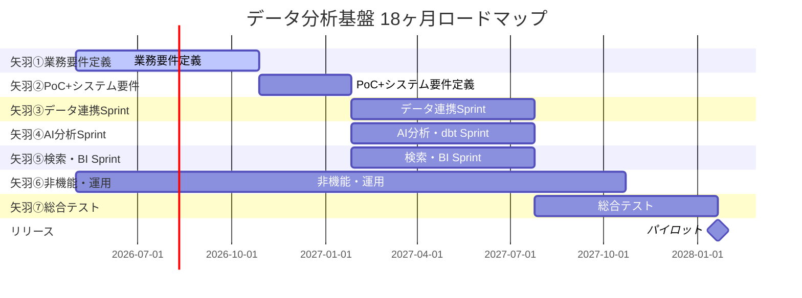
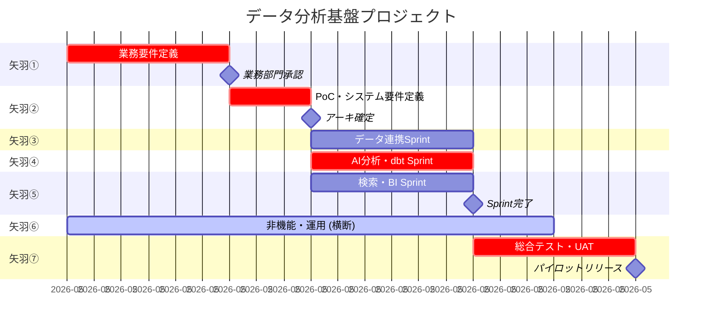

# ロードマップ逆算 (Roadmap Backcasting)

## 概要

プロジェクトのスケジュールを**期限から逆算**して作る手法。
「今からどれくらいでできるか」(フォーキャスト) ではなく「この日に完成させるには逆算して何をいつまでにやるか」で組む。

逆算型の利点:

- 期限固定案件で現実を直視できる
- マイルストーンが明確になる
- スコープ調整の必要性を早期に認識
- クリティカルパスが明確化

## いつ使うか

- キックオフ前にロードマップ案を作る時
- 期限が先に決まった案件 (決算期, 規制対応)
- スコープ交渉時の「このスコープだと無理」の根拠作り
- Layer 6 WBS 作成の前段階

## 手順

### ステップ 1: 最終期限と主要マイルストーンを置く

- ローンチ日 (= パイロット運用開始 or 全面本番リリース)
- その前に UAT 完了日
- その前に 総合テスト完了日
- その前に 開発Sprint 完了日
- その前に 要件確定日
- その前に キックオフ日

### ステップ 2: 矢羽パターンにマッピング

データ分析基盤の標準矢羽 7 構成に配置:

```
矢羽① 業務要件定義     ──┐ (直列)
矢羽② PoC+システム要件   │→ 矢羽③ データ連携 Sprint       ┐ (並列)
                         │→ 矢羽④ AI分析・dbt Sprint       │
                         │→ 矢羽⑤ 検索・BI Sprint          │→ 矢羽⑦ 総合テスト
矢羽⑥ 非機能・運用 ───────────────────────────────────────── (横断)
```

### ステップ 3: クリティカルパスの特定

以下が典型的なクリティカルパス:

```
矢羽① → 矢羽② → 矢羽④ (最重量のSprint) → 矢羽⑦ → ローンチ
```

通常、最も工数が重い Sprint (多くの場合 矢羽④) がクリティカルパスになる。

### ステップ 4: 不確実性バッファの配置

- 要件変更バッファ: 全期間の 15〜20%
- 障害対応バッファ: 全期間の 10%
- ステークホルダー調整バッファ: 矢羽①に +2〜4 週間

年間 1 億円規模では **期間の 20〜30% をバッファ** として持つのが現実的。

### ステップ 5: Gantt チャートで可視化

Mermaid Gantt 記法で描く:



## 典型的な 18ヶ月ロードマップ (データ分析基盤)

### 全体スケジュール

| 矢羽 | 期間 | 開始 | 終了 | 工数 |
|------|------|------|------|------|
| 矢羽① 業務要件定義 | 6ヶ月 | 2026-05 | 2026-10 | 6 人月 |
| 矢羽② PoC+システム要件 | 3ヶ月 | 2026-11 | 2027-01 | 6 人月 |
| 矢羽③ データ連携Sprint | 6ヶ月 (並列) | 2027-02 | 2027-07 | 7.5 人月 |
| 矢羽④ AI分析・dbt Sprint | 6ヶ月 (並列) | 2027-02 | 2027-07 | 8.5 人月 |
| 矢羽⑤ 検索・BI Sprint | 6ヶ月 (並列) | 2027-02 | 2027-07 | 7 人月 |
| 矢羽⑥ 非機能・運用 | 12ヶ月 (横断) | 2026-05 | 2027-07 | 6 人月 |
| 矢羽⑦ 総合テスト | 6ヶ月 | 2027-08 | 2028-01 | 5 人月 |

合計: **46 人月 / 18ヶ月**

### 主要マイルストーン

- **M1**: 2026-10 業務要件定義完了 (業務部門承認)
- **M2**: 2027-01 PoC完了、アーキ確定 (情シス承認)
- **M3**: 2027-04 Sprint 中間レビュー
- **M4**: 2027-07 Sprint 完了 (開発完了)
- **M5**: 2027-10 UAT 合格
- **M6**: 2028-01 パイロットリリース

各マイルストーンで**フェーズゲートレビュー**:
- 前提の再検証
- リスクレジスタの更新
- Kill基準との照合
- 次フェーズ Go/No-Go 判断

## クリティカルパスの典型

### データ分析基盤での CP

通常、以下がクリティカルパス:

```
矢羽① (6ヶ月, 業務部門依存)
    ↓
矢羽② PoC (3ヶ月, 技術検証依存)
    ↓
矢羽④ dbt開発 (6ヶ月, 要件依存 + 人材依存)
    ↓
矢羽⑦ UAT (6ヶ月, ユーザー依存)
```

合計 21ヶ月。18ヶ月に収めるには並列化・スコープ調整が必要。

### CP を短縮する打ち手

| 打ち手 | 効果 | 代償 |
|-------|------|------|
| 矢羽①業務要件定義を 4ヶ月に短縮 | -2ヶ月 | 要件漏れリスク増 |
| 矢羽②PoC と矢羽③④⑤ を一部重ねる | -1ヶ月 | 手戻りリスク増 |
| 矢羽④ AI分析 Sprint を 2 チーム並列 | -2ヶ月 | コスト増、調整コスト増 |
| 矢羽⑦総合テストを 4ヶ月に短縮 | -2ヶ月 | 品質リスク増 |
| パイロットリリースを縮小 | -2ヶ月 | 初期評価の限界 |

## 不確実性バッファの配置ポイント

### バッファの種類

1. **コンティンジェンシーバッファ** (既知のリスクに対する準備)
   - 矢羽①: +2 週間 (ステークホルダー調整)
   - 矢羽②: +1 週間 (PoC失敗時の別案評価)
   - 矢羽④: +2 週間 (dbt モデルのテスト手戻り)
   - 矢羽⑦: +2 週間 (UAT 指摘の反映)

2. **マネジメントバッファ** (未知のリスクに対する余裕)
   - 全体期間の 15% (18ヶ月 → +2.7ヶ月 = 約 3 ヶ月)

### バッファの配置

以下いずれかのパターン:

- **集約型**: 全バッファを最後に置く (Critical Chain 方式)
- **分散型**: 各矢羽に 20% 乗せる (伝統的PM)
- **ハイブリッド**: 既知バッファは該当矢羽、未知バッファは最後

年間 1 億円規模では **ハイブリッド推奨**。

## Mermaid Gantt 例 (実用版)



## スコープ調整の考え方

スケジュールが厳しい時、以下の優先順位で調整:

1. **延期**: 期限を伸ばす (通常は不可)
2. **追加投資**: 人員追加 (効果薄い。Brooks の法則)
3. **スコープ縮小**: 優先度の低い機能を後回し (最も現実的)
4. **品質緩和**: NFR ランディングゾーンを「最小」基準に (諸刃の剣)

**スコープ縮小時のガイドライン:**

- 主要 JTBD を満たすユースケースは死守
- NFR の「最小」水準は死守
- 運用・セキュリティは削らない (矢羽⑥)

## ステークホルダーとの合意形成

逆算ロードマップは**机上論**であり、ステークホルダーとの合意で**命を吹き込む**。

合意形成のポイント:

- 前提を明示する (特に外部依存)
- マイルストーンごとに判断点を設ける
- スコープ調整の余地を残す (MVP, Slice の活用)
- バッファの存在と使い方を合意

## 参考

- Critical Chain (Eliyahu Goldratt, "Critical Chain")
- Backcasting (John Robinson, 1990)
- Roadmap alignment pattern (Roman Pichler)
