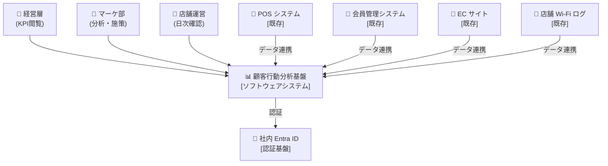
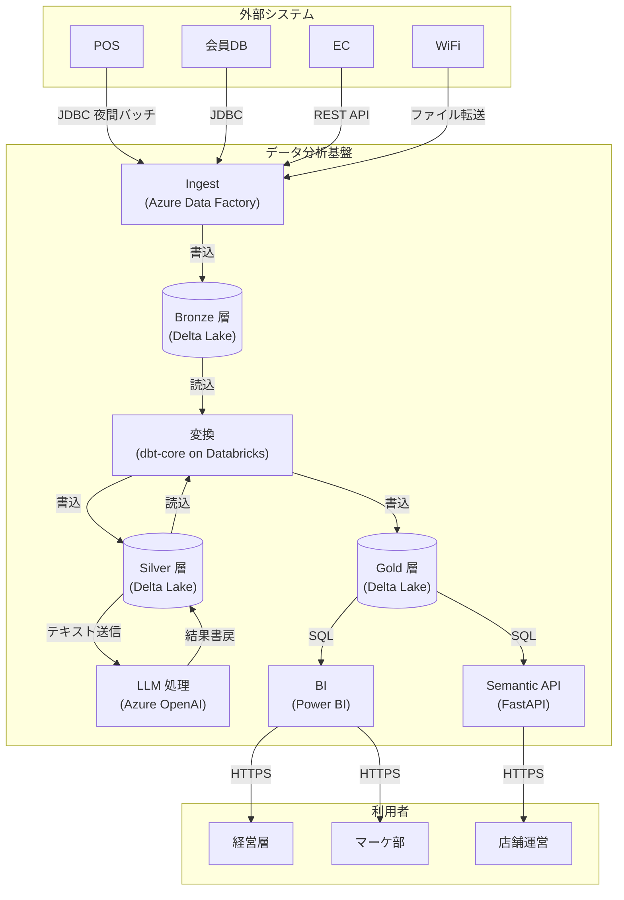
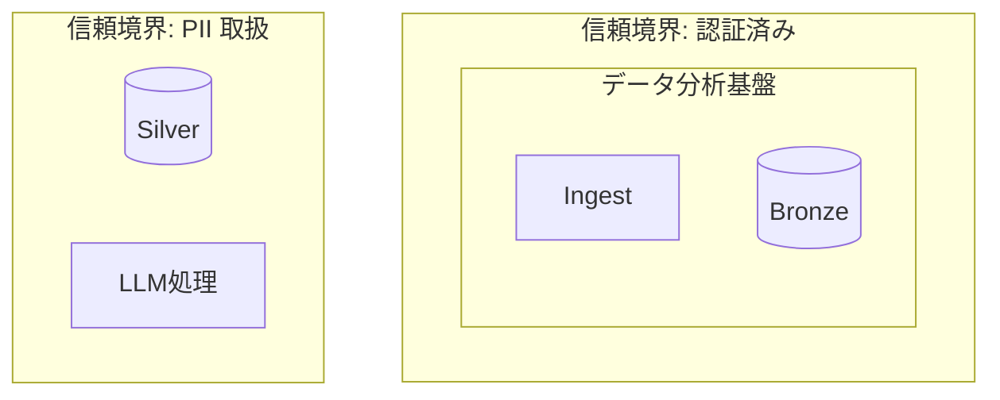
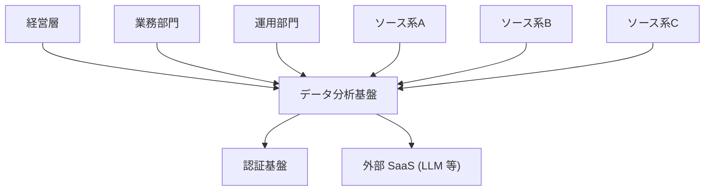
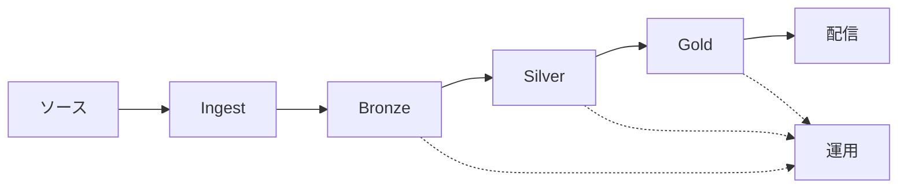

# C4 ダイアグラム

## C4 モデルとは

Simon Brown が提唱した、ソフトウェアアーキテクチャを**4つのズームレベル**で表現するモデル。
地図アプリで世界 → 国 → 都市 → 街区 と拡大するように、システムを 4 段階で可視化する。

| レベル | 名称 | 対象 | 読者 |
|-------|------|-----|------|
| C1 | System Context | システム1つ + ユーザー + 外部システム | 経営層、非技術者 |
| C2 | Container | システム内の実行単位 (アプリ, DB, キュー) | アーキ、開発リード |
| C3 | Component | Container内のコンポーネント (モジュール, サービス) | 開発者 |
| C4 | Code | クラス図、ER図等 | コード書く人 |

青写真段階では **C1 と C2 で十分**。C3/C4 は開発フェーズで必要に応じて作成。

## いつ使うか

- RFP 受領直後、現状を言語化するとき (C1)
- Layer 2 ユースケース抽出後、アーキイメージを共有するとき (C1, C2)
- ADR で代替案を比較する視覚補助として (C2)
- 脅威モデリングの入力として (C2 - 信頼境界を C2 に引く)
- ステークホルダーへの説明資料として (C1)

## C1: System Context 図

### 目的
システムが**外部の誰と何とつながっているか**を 1 枚で見せる。
中身は「ブラックボックス」として扱う。

### 含めるべき要素
- システム本体 (1 つ)
- 人 (ユーザー、管理者、外部監査者 等の役割)
- 外部システム (ソースシステム、認証基盤、SaaS 等)
- 矢印の方向と目的 (読む / 書く / 通知する / 認証 等)

### Mermaid記法の例 (データ分析基盤)



## C2: Container 図

### 目的
システム内部の**実行単位**と、それらの間のデータ/制御フローを示す。
Container は「デプロイ可能な独立した実行単位」: Web アプリ, API, DB, キュー, バッチジョブ等。

### 含めるべき要素
- Container (実行単位)
- 各 Container の技術スタック (Python, Databricks, etc.)
- Container 間のプロトコル (HTTPS, JDBC, S3, etc.)
- 外部システムとのインターフェース
- 信頼境界 (点線で囲む)

### Mermaid記法の例 (データ分析基盤)



### 信頼境界を加える



## C3 (Component) について

青写真段階では **基本不要**。
開発フェーズで特定の Container の内部設計が必要になったら、その Container だけ C3 を描く。

例: `Ingest` Container を C3 で分解すると:
- Source Adapter (POS, 会員DB, EC, WiFi それぞれ)
- Schema Validator
- Error Handler
- Metadata Logger
- Dead Letter Queue Publisher

## C4 (Code) について

通常 C4 レベルは**手描きせず**、コードから自動生成する (class diagram 等)。
青写真段階では完全に対象外。

## 描画のコツ

### コツ 1: 1 図 = 1 レベル
C1 の図に Container を混ぜない。レベルを混在させると読みにくくなる。

### コツ 2: 図に凡例を付ける
- 箱の形 (⬛ = Container, ⬜ = 人, 🔌 = 外部)
- 矢印の線種 (実線 = 同期, 破線 = 非同期)

### コツ 3: ラベルには「何のために」を書く
- 悪い例: `DB --> App`
- 良い例: `DB -->|顧客情報の問合せ| App`

### コツ 4: 登場人物は多すぎない
- C1 は 5〜10 要素
- C2 は 10〜15 Container
- 超えたら図を分割

### コツ 5: バージョン管理に優しい形式を選ぶ
- Mermaid, PlantUML はテキストなので Git 差分管理できる
- ドローツール (Draw.io 等) は二次成果物として使う

## データ分析基盤の C1/C2 典型パターン

### C1 テンプレート (どの案件でも使える骨格)



### C2 テンプレート (メダリオン)



## 出力フォーマット

C4 図は以下の場所に保存:

```
docs/
└── architecture/
    ├── c1-system-context.md   (Mermaid埋込 + 説明)
    ├── c2-containers.md       (Mermaid埋込 + 説明)
    └── c3/                    (必要に応じて)
```

各 md ファイルに:
- Mermaid コード
- 凡例
- 説明文 (各要素が何か、なぜそう選んだか → ADR へのリンク)
- 更新履歴

## 参考

- Simon Brown, "The C4 Model for Software Architecture", https://c4model.com/
- Mermaid Live Editor, https://mermaid.live/
