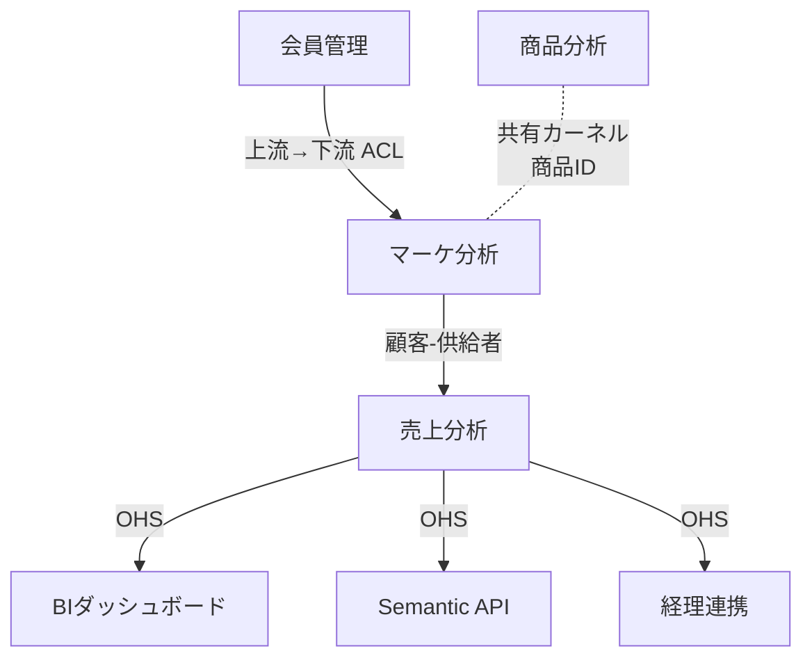

# DDD コンテキスト分析 (戦略的設計)

## 概要

ドメイン駆動設計 (Domain-Driven Design) には 2 つの階層がある:

- **戦略的設計**: 大きな問題領域を分割し、境界を引く (境界づけられたコンテキスト, コンテキストマップ, ユビキタス言語)
- **戦術的設計**: 各コンテキスト内のモデリング (Aggregate, Entity, Value Object, Repository)

年間 1 億円規模のデータ分析基盤では **戦略的設計のみ** に絞る。戦術的設計は実装チームが必要に応じて採用する。

## なぜ DDD 戦略的設計か?

データ分析基盤は「データを扱う」以上に「**複数部門の業務ルールが交差する**」場所。
境界を引かずに全てを 1 つのスキーマに詰め込むと:

- 部門ごとに異なる「顧客」定義を強制統一しようとして紛争
- 共通化したテーブルが全部門を満足させられず、結局サイロ化
- 変更の波及範囲が予測できない

**境界づけられたコンテキスト**で分割すれば、各領域ごとにユビキタス言語 (共通語彙) を育てられ、変更の影響を局所化できる。

## いつ使うか

- ユースケース一覧ができた直後 (コンテキスト分割の材料)
- C2 Container 図を描く前 (Container 境界とコンテキスト境界の整合を確認)
- 複数部門の要件が錯綜している時
- データモデル統一 vs 分散の議論が起きた時

## 手順

### ステップ 1: ユビキタス言語候補の洗い出し

Layer 2 のユースケース、インタビュー記録、既存 Excel ファイル名等から**名詞**を抽出:

- 顧客、会員、消費者、ユーザー
- 売上、受注、取引、購買、注文
- 商品、品目、SKU、アイテム
- 店舗、支店、拠点

### ステップ 2: 同じ名詞でも意味が違うか確認

同じ言葉が部門によって違う意味を持つ場合、そこにコンテキスト境界がある:

| 言葉 | マーケ部の意味 | 経理部の意味 | 店舗の意味 |
|-----|-------------|-------------|-----------|
| 顧客 | 会員登録済み個人 | 請求書発行先 (法人含) | レジに来た人 (非会員含) |
| 売上 | 税抜 | 税込 | POS 上の金額 |
| 商品 | 企画商品 (セット含) | SKU | 陳列単位 |

同じ言葉でも意味が違えば、**別のコンテキスト**として扱う。

### ステップ 3: コンテキスト候補の列挙

ユースケースを部門・目的ごとにクラスタリング:

```
- マーケ分析コンテキスト: セグメント, キャンペーン, 会員行動
- 売上分析コンテキスト: POS データ, 店舗別売上, 経理連携
- 商品分析コンテキスト: SKU, 価格, 在庫
- 会員管理コンテキスト: 会員登録, 属性, 会員ランク
- 業務連携コンテキスト: 取込, マスタ同期, 配信
```

### ステップ 4: コンテキストマップの作成

コンテキスト間の関係を図示する。以下の 5 パターンで表現:

#### パターン 1: 上流・下流 (Upstream / Downstream)
- 上流が下流に影響を与える。下流は上流の変更に追随
- 例: 会員管理 (上流) → マーケ分析 (下流)

#### パターン 2: 共有カーネル (Shared Kernel)
- 複数コンテキストで共通の小さなモデルを共有
- 変更は全員の合意で行う
- 例: 「日付」「通貨」のような基本型

#### パターン 3: 顧客-供給者 (Customer-Supplier)
- 上流・下流関係の強化版。下流のニーズを上流が積極的に受け入れる
- 例: 経理 (顧客) に売上分析 (供給者) が KPI フォーマットを合わせる

#### パターン 4: 順応者 (Conformist)
- 下流は上流に合わせるしかない。変換コストを払えない
- 例: 外部 SaaS (上流) に合わせるしかないマーケ分析 (下流)

#### パターン 5: 腐敗防止層 (Anti-Corruption Layer, ACL)
- 下流が上流の概念を**変換**して取り込む
- 上流のモデルが下流の純度を汚さないようにする
- データ分析基盤では **Bronze → Silver** で ACL を実装

#### パターン 6: 公開ホストサービス (Open Host Service, OHS)
- 多くの下流が利用するため、標準化されたインターフェースを公開
- 例: Gold 層が OHS、BI・API・外部連携等複数の下流が利用

#### パターン 7: 公開された言語 (Published Language, PL)
- 複数コンテキストで共通のスキーマ・用語
- 例: Semantic Layer (LookML, dbt Semantic Layer)

### ステップ 5: コンテキストマップの表記

ASCII または Mermaid で図示。

#### ASCII 例

```
[会員管理]
    ↓ (上流→下流, ACL)
[マーケ分析] ←→ [商品分析]  (共有カーネル: 商品ID)
    ↓ (顧客-供給者)
[売上分析]
    ↓ (OHS)
[BI] [API] [経理連携]
```

#### Mermaid 例



### ステップ 6: 各コンテキストのユビキタス言語を定義

コンテキストごとに用語集を作成:

**マーケ分析コンテキスト:**
- 顧客 = 会員登録済み個人 (一意に識別可能)
- セグメント = 属性と行動で定義されたグループ
- リテンション = 30日以内再購入率

**売上分析コンテキスト:**
- 顧客 = 取引相手 (法人含む場合あり)
- 売上 = 税抜金額
- 取引 = POS or EC で発生した購買イベント

**会員管理コンテキスト:**
- 会員 = CRM システムに登録された個人
- ランク = 年間購買額に応じたグレード
- 同意 = マーケティング利用同意フラグ

## データ分析基盤の典型コンテキスト分割

**パターン A: 業務ドメイン別 (最も一般的)**

1. 顧客ドメイン: 会員、属性、行動履歴
2. 取引ドメイン: 売上、受注、購買
3. 商品ドメイン: マスタ、価格、在庫
4. マーケドメイン: キャンペーン、セグメント、効果測定
5. 業務連携ドメイン: 取込、配信、監査ログ

**パターン B: 機能別 (メダリオンを意識)**

1. 取り込みコンテキスト: Ingest, Bronze 層
2. 正規化コンテキスト: Silver 層、データ品質
3. 分析コンテキスト: Gold 層、Mart
4. 配信コンテキスト: BI, API, Semantic Layer
5. 運用コンテキスト: ガバナンス、監視、コスト

**パターン C: ハイブリッド**
A と B の組み合わせ。最も現実的だが、説明が複雑になる。

## 年間1億円規模での現実解

- コンテキストは **3〜5 個**に絞る
- コンテキストマップは 1 枚で収まるサイズ
- ユビキタス言語は**各コンテキスト 10〜20 用語**まで (全部辞書化しない)
- 戦術的設計 (Aggregate, Entity 等) は書かない

## 注意点

### 注意 1: コンテキスト = テーブル分割とは限らない

コンテキスト境界は**意味的な境界**。物理的には同じ DWH 内でも、スキーマ分離 (例: `marketing.*`, `sales.*`) で十分な場合が多い。

### 注意 2: ユビキタス言語は育てるもの

最初から完璧にはならない。矢羽①業務要件定義で洗い出し、矢羽③④⑤のスプリントで継続的に精緻化する。

### 注意 3: 共通化を急がない

「顧客」を全社共通定義にしようとしてデッドロック → 各コンテキストで別々に定義 + マッピング層を設ける、の方が実用的な場合が多い。

## 出力フォーマット

```
docs/
└── domain/
    ├── context-map.md          (図 + 全体説明)
    ├── context-marketing.md    (マーケ分析 用語集)
    ├── context-sales.md        (売上分析 用語集)
    ├── context-customer.md     (顧客 用語集)
    ├── context-product.md      (商品 用語集)
    └── context-integration.md  (業務連携 用語集)
```

## 参考

- Eric Evans, "Domain-Driven Design", 2003 (原典)
- Vaughn Vernon, "Implementing Domain-Driven Design", 2013
- melodic-software/enterprise-architecture: https://www.claudepluginhub.com/plugins/melodic-software-enterprise-architecture-plugins-enterprise-architecture
- Context Map Cheat Sheet (GitHub ddd-crew)
