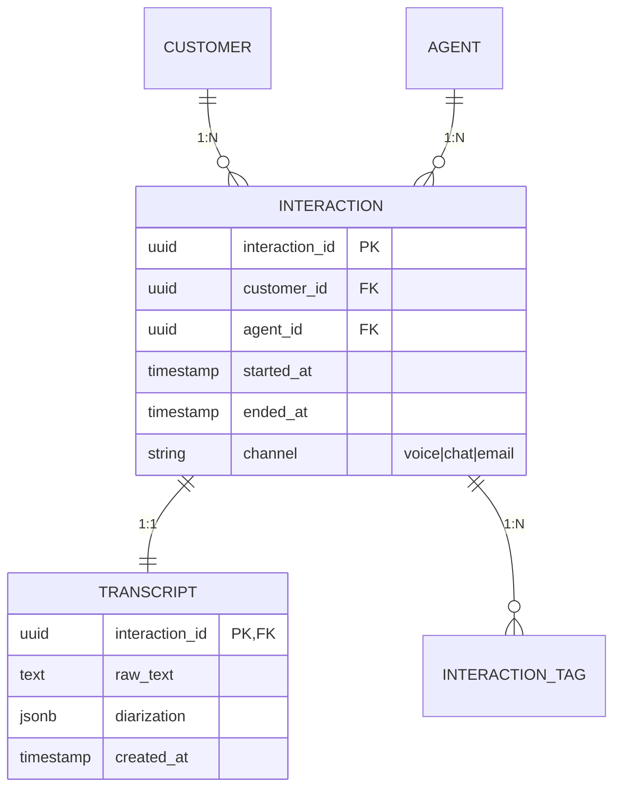

# データ設計詳細 (Entity / Tx / Outbox / Delivery / Consistency / History / SoT)

## 対応する品質ゲート

| ID | 観点 | 既定の Fail/Conditional 条件 |
|----|------|------|
| DATA-ENTITY-001 | エンティティと関連 | 主要エンティティの ER 図と主キー・外部キー・カーディナリティが未定義 |
| DATA-TX-001 | トランザクション境界 | 1 ユースケース内で原子性が必要な範囲が宣言されていない |
| DATA-OUTBOX-001 | Outbox / Saga | 跨サービス更新で整合性確保パターンが選択されていない |
| DATA-DELIVERY-001 | メッセージ配信保証 | at-most-once / at-least-once / exactly-once の選択が宣言されていない |
| DATA-CONSISTENCY-001 | 整合性モデル | ACID / BASE / Eventually Consistent のどれを選ぶか宣言されていない |
| DATA-HISTORY-001 | 履歴保持 | 履歴・監査要件 (WORM / Event Sourcing / SCD Type 2) が未定義 |
| DATA-SOT-001 | Source of Truth | 同じデータが複数システムにある時の SoT 宣言がない |

## 概要

データ設計は「箱と矢印」だけ書けば終わりではない。**エンティティ → トランザクション → サービス間整合 → 配信保証 → 履歴 → SoT** の 6 段階を順に詰めて初めて、運用に耐える基盤になる。

本スキルは矢羽パターン (要件 → 設計 → 実装) の **③ 詳細設計** で利用し、既存スキル「ADR作成.md」「論理データモデル.md」と連動させる。

## いつ使うか

- ユースケースが固まって、データの永続化先・更新範囲を確定する時
- 複数サービス (Genesys / Databricks / SAP / Azure OpenAI 等) を跨ぐ更新が発生する時
- 監査・コンプライアンス要件 (個人情報保護法, 電子帳簿保存法, J-SOX) が絡む時
- 顧客問合せ履歴・トランスクリプトなど不可逆データを扱う時

## 手順 (6 段階)

### ① エンティティと関連を ER 図で確定する (DATA-ENTITY-001)

1. **主要エンティティの抽出**
   - ユースケースから名詞を抽出
   - 一覧化し、重複・揺らぎを正規化 (例: `顧客` / `お客様` / `Customer` を統一)
2. **主キー・外部キーの宣言**
   - サロゲートキー (UUID v7 / ULID) を原則とする (自然キーは変わるため)
   - 外部キーは方向と必須性 (NOT NULL / NULL 可) を明記
3. **カーディナリティと参加度**
   - 1:N / N:M / 1:1 を Crow's Foot 記法で図示
   - 0..1 / 1..1 / 0..N / 1..N の参加度も明記
4. **物理化の方針**
   - リレーショナル / ドキュメント / 列指向 / グラフ / KVS のどれに載せるか
   - パーティション戦略 (日付・テナント・ハッシュ) を併記

**コールセンター実例 (Genesys + Databricks):**



### ② トランザクション境界を宣言する (DATA-TX-001)

1. **「ここからここまでは原子的」を 1 文で書く**
   - 例: 「`INTERACTION` 作成 + `INTERACTION_TAG` 初期登録は原子的。失敗時は両方ロールバック」
2. **境界の選択肢**
   - **DB トランザクション** (同一 DB 内なら最も単純)
   - **Saga (補償トランザクション)** (跨サービス時)
   - **2PC (分散トランザクション)** (基本回避。Genesys / SAP は対応していない)
3. **隔離レベルの選択**
   - Read Committed (デフォルト, ほぼ常にこれ)
   - Repeatable Read (在庫減算など同一行を二度読む処理)
   - Serializable (会計仕訳・残高更新など最重要のみ)
4. **失敗時の振る舞い**
   - リトライ可否、冪等性キー、補償処理の対象を ADR に記述

**宣言例:**

```yaml
tx_boundary:
  id: TX-001
  scope: 顧客問合せ受付 (UC-002)
  atomic_operations:
    - INTERACTION INSERT
    - INTERACTION_TAG INSERT (複数)
    - OUTBOX INSERT (Databricks 送信用)
  isolation: Read Committed
  retry_policy: idempotency_key=interaction_id, max_retry=3
  rollback_strategy: DB rollback (single Postgres tx)
```

### ③ Outbox / Saga を選定する (DATA-OUTBOX-001)

跨サービス更新がある場合、整合性確保パターンを選ぶ。**「DB 更新と外部送信を別々に書くのは禁止」** が原則。

| パターン | 概要 | 利用シーン |
|---------|------|---------|
| **Transactional Outbox** | DB 更新と同 Tx で `outbox` テーブルに書き、別ワーカーが送信 | DB → Kafka / Event Hubs / Service Bus |
| **Saga (Choreography)** | 各サービスがイベントを発行し連鎖。中央コーディネータなし | 疎結合・3〜5 サービス程度 |
| **Saga (Orchestration)** | 中央のコーディネータがステートマシンを管理 | 6 サービス以上、複雑な分岐あり |
| **Change Data Capture (CDC)** | DB のトランザクションログを Debezium 等で取得 | 既存 DB を変更せず外部連携 |
| **Inbox** | 受信側で重複を排除する受信箱テーブル | exactly-once 相当を低コストで実現 |

**コールセンター実例 (Outbox + Inbox):**

```
Genesys Webhook
   ↓ (HTTPS)
[受付サービス Postgres]
   ├─ INTERACTION INSERT
   └─ OUTBOX INSERT (同一 Tx)
        ↓ (Outbox Worker, 5 秒間隔)
[Azure Event Hubs]
        ↓
[Databricks Auto Loader] → INBOX テーブル (重複排除) → Bronze 層
```

**ADR 記載例:** ADR-0010 「Outbox + Event Hubs を採用、CDC は Phase 2 に延期」

### ④ メッセージ配信保証を宣言する (DATA-DELIVERY-001)

| 保証 | 意味 | 採用しがちな箇所 |
|-----|------|-----------|
| **at-most-once** | 失敗時に欠落の可能性あり | 監視メトリクス、ログ転送 |
| **at-least-once** | 重複の可能性あり、欠落なし | **デフォルト推奨**。受信側で冪等処理 |
| **exactly-once (effectively-once)** | 完全 1 回 (配信側 + 受信側冪等) | 会計・残高・課金 |

**鉄則:** 配信側で完全な exactly-once は不可能。**「at-least-once + 受信側冪等」** で effectively-once を実現する。

**宣言例:**

```yaml
delivery_guarantee:
  flow: Genesys → Postgres → Event Hubs → Databricks
  guarantee: at-least-once (effectively-once)
  idempotency_key: interaction_id
  dedup_window: 24h (Inbox テーブルで判定)
  dlq: enabled (3 回リトライ後 DLQ へ)
```

### ⑤ ACID / BASE / 整合性モデルを宣言する (DATA-CONSISTENCY-001)

| モデル | 特徴 | 採用例 |
|-------|------|---------|
| **ACID (Strong)** | 即時整合・原子性 | Postgres 上の業務 Tx、SAP 仕訳 |
| **BASE / Eventually Consistent** | 一定時間後に整合 | Databricks の Bronze→Silver→Gold 集計 |
| **Read-your-Writes** | 自分が書いた値は自分には即見える | ユーザー画面、操作直後の確認 |
| **Causal Consistency** | 因果関係のあるイベントは順序保持 | Saga のイベント連鎖 |
| **Tunable (per query)** | クエリ単位で調整 | Cosmos DB / Cassandra |

**鉄則:**

- 「強整合が要るのは金額・在庫・本人確認の 3 つだけ」を社内合言葉に
- それ以外は **Eventually Consistent + 結果整合の遅延 SLA** を宣言

**宣言例:**

```yaml
consistency:
  - context: 顧客問合せ受付 (UC-002)
    model: ACID (Postgres single-node tx)
  - context: 通話分析結果の集計 (UC-007)
    model: Eventually Consistent
    max_lag: 15 minutes (Bronze → Gold の SLA)
  - context: SAP 売上仕訳との突合
    model: ACID + 日次クローズ
    closing_window: T+1 09:00 JST
```

### ⑥ 履歴保持戦略を宣言する (DATA-HISTORY-001)

| 戦略 | 特徴 | 採用例 |
|-----|------|---------|
| **WORM (Write Once Read Many)** | 書込み後不変。改ざん不可 | コール音声、監査ログ、電子帳簿 |
| **Event Sourcing** | 変更を全イベントとして残し、状態は再生で得る | 注文・残高・ワークフロー |
| **SCD Type 2 (Slowly Changing Dim)** | DWH の次元テーブルで履歴行を持つ | 顧客マスタ、商品マスタ |
| **Append-only Log** | INSERT のみ、UPDATE/DELETE 禁止 | センサーデータ、コールログ |
| **Tombstone + TTL** | 削除フラグ + 期限後物理削除 | 個人情報の利用停止対応 |

**鉄則:**

- **不可逆データは UPDATE 禁止**。新行を追加して `valid_from / valid_to` で管理
- 法定保存期間 (税務 7 年, 医療 5 年, J-SOX 7 年) を要件として明記
- 個人情報の右忘却権 (削除請求) と監査ログ保持の両立を設計時に検討

**コールセンター実例:**

```yaml
history:
  - entity: TRANSCRIPT
    strategy: WORM
    retention: 7 years (J-SOX, 個人情報削除請求は擬似匿名化で対応)
    storage: Azure Blob (Immutable Policy)
  - entity: CUSTOMER
    strategy: SCD Type 2
    columns: [valid_from, valid_to, is_current]
    retention: 削除後 7 年 (履歴のみ保持、現行行は削除)
  - entity: AGENT_ACTIVITY
    strategy: Append-only
    partition: daily
    retention: 90 days (Hot) + 7 years (Cold / Archive)
```

### ⑦ Source of Truth (SoT) を宣言する (DATA-SOT-001)

「同じデータが 2 箇所にある」状態は必ず発生する。**どちらが正なのか** を 1 文で宣言する。

**宣言テンプレート:**

```yaml
sot_declarations:
  - data: 顧客マスタ (氏名・連絡先)
    sot: SAP S/4HANA (BUSINESS_PARTNER)
    replica:
      - Genesys (read-only, 30 分遅延許容)
      - Databricks Silver (CDC 経由, 5 分遅延許容)
    write_path: SAP のみ。他システムからの直接更新は禁止
  - data: 通話履歴 (Interaction)
    sot: Genesys Cloud
    replica:
      - Postgres (受付サービス, リアルタイム)
      - Databricks Bronze (Auto Loader, 1 分遅延許容)
    write_path: Genesys のみ。Postgres は読み取り専用キャッシュ
  - data: 通話分析結果 (Sentiment, Intent)
    sot: Databricks Gold (silver_interaction_analysis)
    replica:
      - Power BI Dataset (15 分リフレッシュ)
    write_path: Databricks のみ。BI からの書き戻しは禁止
```

**鉄則:**

- SoT は 1 つだけ。複数 SoT は「不整合製造機」になる
- レプリカは必ず読み取り専用扱い、書き戻し経路は明示的に禁止
- SoT 変更時はレプリカへの伝搬 SLA (最大遅延) を明記

## 出力フォーマット

データ設計成果物は以下のセットで出力する:

```
docs/
├── data-design/
│   ├── 01_erd.md                 # ER 図 (Mermaid)
│   ├── 02_tx_boundaries.yaml     # Tx 境界宣言
│   ├── 03_outbox_saga.md         # Outbox/Saga 設計 + シーケンス図
│   ├── 04_delivery_guarantees.yaml
│   ├── 05_consistency_model.yaml
│   ├── 06_history_strategy.yaml
│   └── 07_source_of_truth.yaml
└── adr/
    ├── 0010-outbox-pattern.md
    ├── 0011-history-strategy.md
    └── 0012-sot-declaration.md
```

## 例示: ABC社 VoC 分析基盤

| 項目 | 設計 |
|-----|------|
| 主要エンティティ | INTERACTION / TRANSCRIPT / VOC_TAG / CUSTOMER (CRM 参照) |
| Tx 境界 | INTERACTION + 初期 VOC_TAG は原子的 (Postgres single tx) |
| Outbox | Postgres → Service Bus → Snowflake (Cortex AI 入力) |
| 配信保証 | at-least-once + Inbox 重複排除 (interaction_id) |
| 整合性 | 受付は ACID、分析結果は Eventually Consistent (15 分遅延 SLA) |
| 履歴 | TRANSCRIPT は WORM (Azure Blob Immutable, 5 年保持) |
| SoT | INTERACTION は Genesys、CUSTOMER は SAP CRM、VOC タグは Snowflake Gold |

## 作成時のチェックリスト

- [ ] 主要エンティティが ER 図で図示されている (Mermaid または PlantUML)
- [ ] 全エンティティに主キー (UUID v7 / ULID 推奨) と必要な外部キーが定義されている
- [ ] カーディナリティが Crow's Foot 等で明示されている
- [ ] 各ユースケースに Tx 境界が 1 つ以上宣言されている
- [ ] 跨サービス更新には Outbox / Saga / CDC のいずれかが選定済み
- [ ] 配信保証 (at-most/at-least/exactly) が宣言されている
- [ ] 整合性モデルが宣言され、結果整合なら最大遅延 SLA が記載されている
- [ ] 履歴戦略 (WORM / Event Sourcing / SCD2 / Append-only) が選定されている
- [ ] 法定保存期間が記載されている
- [ ] 同一データが複数システムに存在する場合 SoT が宣言されている
- [ ] レプリカは読み取り専用扱いで、書き戻し経路が明示禁止されている
- [ ] 関連 ADR (Outbox 採用、SoT 宣言など) が起票されている

## pm-blueprint 連携

| 既存サブスキル | 連携ポイント |
|--------------|-----------|
| `layer-3-architecture/論理データモデル.md` | エンティティ抽出と正規化はそちらで先行。本スキルは「物理化 + Tx + 配信」を上乗せ |
| `layer-3-architecture/ADR作成.md` | Outbox 採用 / SoT 宣言 / 履歴戦略は ADR (Type 1) として起票 |
| `layer-3-architecture/API設計.md` | Idempotency-Key 設計は本スキルの DATA-DELIVERY-001 と一体で運用 |
| `layer-4-requirements/SMART非機能要件.md` | 配信遅延 SLA、履歴保持期間、整合性遅延は NFR としてランディングゾーン化 |
| `layer-4-requirements/SLI_SLO_エラーバジェット.md` | 結果整合の最大遅延を SLI として計測対象に |

## 品質ゲート対応サマリ

| ゲート ID | 本スキル該当節 | 出力アーティファクト |
|----------|--------------|------------------|
| DATA-ENTITY-001 | 手順 ① | `docs/data-design/01_erd.md` |
| DATA-TX-001 | 手順 ② | `docs/data-design/02_tx_boundaries.yaml` |
| DATA-OUTBOX-001 | 手順 ③ | `docs/data-design/03_outbox_saga.md` + ADR |
| DATA-DELIVERY-001 | 手順 ④ | `docs/data-design/04_delivery_guarantees.yaml` |
| DATA-CONSISTENCY-001 | 手順 ⑤ | `docs/data-design/05_consistency_model.yaml` |
| DATA-HISTORY-001 | 手順 ⑥ | `docs/data-design/06_history_strategy.yaml` + ADR |
| DATA-SOT-001 | 手順 ⑦ | `docs/data-design/07_source_of_truth.yaml` + ADR |

## 参考

- Chris Richardson, "Microservices Patterns" (Saga, Outbox の標準解説)
- Martin Kleppmann, "Designing Data-Intensive Applications" (整合性モデル, 配信保証)
- Kimball, "The Data Warehouse Toolkit" (SCD Type 2)
- Microsoft Azure Architecture Center: Transactional Outbox / Saga
- Databricks "Medallion Architecture" (Bronze/Silver/Gold と整合性遅延 SLA)
- 電子帳簿保存法 / J-SOX / 個人情報保護法 (履歴保持の法的要件)
