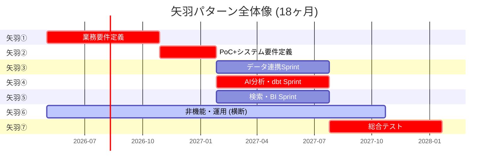
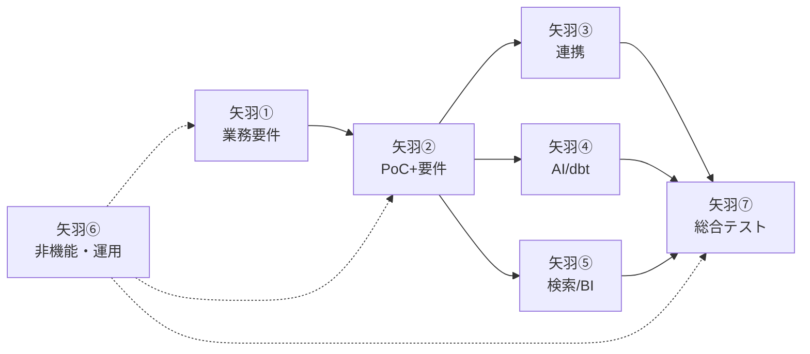

# 矢羽パターンWBS テンプレート

## 矢羽パターンとは

日本の SIer 文化で広く使われる、**折れ線グラフの矢羽根**に似た形状のフェーズ分解。
各矢羽は 1 つの主目的を持ち、前の矢羽の完了を待って次に進む (ウォーターフォール的)。
ただし中間の開発フェーズは矢羽を**複数並列**に走らせる (アジャイル的)。

特徴:
- 前工程・後工程が明確 → 経営層や管理者に理解しやすい
- 並列矢羽でスピード確保
- 横断矢羽 (非機能・運用) で抜け漏れ防止

## 概念図



## 矢羽の特性

| タイプ | 特徴 | 該当矢羽 |
|-------|------|----------|
| 直列 | 前の矢羽完了を待つ | 矢羽①②⑦ |
| 並列 | 同じ時期に複数走る | 矢羽③④⑤ |
| 横断 | 全期間または複数矢羽にまたがる | 矢羽⑥ |

## L2 / L3 / L4 の粒度基準

### L2 (矢羽): フェーズレベル
- 期間: 3〜12ヶ月
- 工数: 5〜12 人月
- 成果物: フェーズ完了時のマイルストーン
- 承認者: プロジェクトスポンサー

### L3 (アクティビティ): 成果物単位
- 期間: 2〜8 週間
- 工数: 1〜2 人月
- 成果物: 意味のある中間成果物
- 担当: チームリード

### L4 (タスク): 個人が 1 人で担当可能
- 期間: 1〜5 人日
- 工数: 0.1〜0.5 人月
- 成果物: レビュー可能な成果物片
- 担当: 個別メンバ

## 各矢羽の L3 アクティビティ例

### 矢羽① 業務要件定義 (6人月/6ヶ月) - 直列・ウォーターフォール

**L3 (8個):**
1. 現行業務ヒアリング
2. ユースケース案策定
3. データ棚卸
4. IF 方式の当たり付け
5. 分析軸・KPI 整理
6. 機能要件概要整理
7. 環境準備
8. PoC 計画

### 矢羽② PoC + システム要件定義 (6人月/3ヶ月) - 直列・ウォーターフォール

**L3 (7個):**
1. PoC 環境構築
2. データ連携検証
3. LLM / AI 検証
4. モデル比較検証
5. データ統合検証
6. 結果評価・アーキ確定
7. システム要件定義書作成

### 矢羽③ データ連携Sprint (7.5人月/6ヶ月) - 並列・アジャイル

**L3 (6個):**
1. 外部連携設計
2. 外部連携開発
3. データ取込パイプライン開発
4. 業務データ連携設計
5. 業務データ取込開発
6. 結合テスト

### 矢羽④ AI分析・dbt 開発Sprint (8.5人月/6ヶ月) - 並列・アジャイル

**L3 (7個):**
1. Bronze / Silver / Gold 設計
2. Bronze → Silver 開発
3. Silver → Gold Mart 開発
4. 分類マスタ設計
5. AI 分析パイプライン開発
6. チューニング
7. マスタ最終調整

### 矢羽⑤ 検索・BI 開発Sprint (7人月/6ヶ月) - 並列・アジャイル

**L3 (7個):**
1. Semantic Model 設計
2. 検索インデックス構築
3. Text2SQL 開発
4. ダッシュボード開発
5. エクスポート機能
6. チューニング
7. UI 改修

### 矢羽⑥ 非機能・運用 (6人月/12ヶ月) - 横断

**L3 (9個):**
1. 非機能要件定義
2. IaC 設計・実装
3. CI/CD 構築
4. 監視ダッシュボード
5. アラート設定
6. 障害対応フロー
7. 運用手順書整備
8. ハンズオン
9. 展開計画策定

### 矢羽⑦ 総合テスト・パイロット展開 (5人月/6ヶ月) - 直列・ウォーターフォール

**L3 (7個):**
1. テスト計画
2. 結合テスト
3. 総合テスト・性能テスト
4. UAT
5. 本番移行リハーサル
6. パイロットリリース
7. リリース判定・振り返り

## 並列Sprint (矢羽③④⑤) の設計

### スプリント期間
- 推奨: **2 週間**
- 理由: 長すぎると振り返りが遅い、短すぎるとセレモニーオーバーヘッドが大きい
- 例外: 初期 Sprint 0 (環境構築) は 1 週間でも可

### ベロシティ想定
- 矢羽③ (データ連携): 20〜30 ストーリーポイント / Sprint / チーム
- 矢羽④ (AI分析): 30〜40 SP / Sprint / チーム (要件の不確実性高)
- 矢羽⑤ (BI): 25〜35 SP / Sprint / チーム

チーム 2〜3 名規模を想定。

### セレモニー構成

| セレモニー | 頻度 | 時間 | 参加者 |
|-----------|------|------|-------|
| Sprint Planning | 2 週間に 1 回 | 2 時間 | 全チーム |
| Daily Standup | 毎日 | 15 分 | 全チーム |
| Sprint Review | 2 週間に 1 回 | 1 時間 | 全チーム + ステークホルダー |
| Sprint Retrospective | 2 週間に 1 回 | 1 時間 | 全チーム |
| バックログリファインメント | 週 1 回 | 1 時間 | PO + リード |

並列 Sprint (③④⑤) はデモを**同時開催**することを推奨 (2 週に 1 回、2 時間で全チーム発表)。

### スプリント間依存の管理

並列 Sprint は依存関係が発生する:

- 矢羽③ (データ連携) → 矢羽④ (dbt)
  - 新データソース取込完了 → dbt モデル着手
- 矢羽④ → 矢羽⑤ (BI)
  - Gold Mart完成 → ダッシュボード着手

依存解消の仕組み:

- **週次 Sprint of Sprints**: PO 3 名でブロッカー共有 (週 1 回 30 分)
- **依存マトリクス**: 矢羽間の前提を明文化
- **モックデータ**: 依存先完成前でも開発を進める準備

## 工数見積方法

### ボトムアップ積み上げ

```
L4 タスク工数 (0.1〜0.5 人月/各)
    ↓ 合計
L3 アクティビティ工数 (1〜2 人月)
    ↓ 合計
L2 矢羽工数 (5〜12 人月)
    ↓ 合計
全体工数 (40〜50 人月)
```

### 精度の担保

- L4 タスクは**具体的に 1 人が担当して何日で終わるか**を想像できる粒度
- 不明なタスクには 30% バッファ
- 類似プロジェクトの実績と照らす (±30% 以内なら妥当)

### 例: 矢羽④ AI分析・dbt 開発Sprint (8.5 人月)

```
Bronze/Silver/Gold 設計 (0.8 人月)
   ├── Bronze 層スキーマ決定 (0.2)
   ├── Silver 層共通命名ルール策定 (0.2)
   ├── Gold 層 Mart 設計 (0.4)

Bronze → Silver 開発 (1.5 人月)
   ├── Silver 共通変換ロジック開発 (0.3)
   ├── POS → Silver (0.4)
   ├── 会員DB → Silver (0.4)
   ├── EC → Silver (0.4)

Silver → Gold Mart 開発 (2.0 人月)
   ├── 売上 Mart (0.5)
   ├── 会員 Mart (0.5)
   ├── キャンペーン Mart (0.5)
   ├── 統合 KPI Mart (0.5)

分類マスタ設計 (0.5 人月)
   ├── 商品カテゴリマスタ (0.2)
   ├── セグメント定義 (0.3)

AI 分析パイプライン開発 (2.5 人月)
   ├── LLM 接続・プロンプト設計 (0.5)
   ├── 分類パイプライン実装 (1.0)
   ├── 要約パイプライン実装 (0.7)
   ├── テスト・アライメント (0.3)

チューニング (0.7 人月)
   ├── コスト最適化 (0.3)
   ├── 性能チューニング (0.4)

マスタ最終調整 (0.5 人月)
   ├── 業務部門レビュー反映 (0.3)
   ├── ドキュメント更新 (0.2)
```

合計: 8.5 人月 ✓

## 依存関係の可視化

### 矢羽間依存 (Mermaid flowchart)



### Sprint 間依存

矢羽③④⑤ 内部の Sprint 間依存を Excel or Notion で管理:

| Sprint | 前提 (From) | 提供物 (To) |
|--------|------------|------------|
| 矢羽③ S1 | - | Bronze 層初期スキーマ |
| 矢羽④ S1 | 矢羽③ S1 Bronze スキーマ | Silver 共通変換ロジック |
| 矢羽④ S2 | 矢羽④ S1 Silver 変換 | Gold 売上 Mart |
| 矢羽⑤ S2 | 矢羽④ S2 売上 Mart | 売上ダッシュボード α 版 |

## WBS 表のフォーマット

詳細は `templates/WBS雛形_矢羽パターン.md` 参照。主要列:

```
| No | L2矢羽 | L3アクティビティ | L4タスク | 工数(人月) | 担当ロール | 依存 | 関連リスクID | 成果物 |
```

## 作成時のチェックリスト

- [ ] 7 つの矢羽すべてが定義されている (データ分析基盤の場合)
- [ ] 各矢羽に L3 が 3〜8 個ある
- [ ] 各 L3 に L4 が 3〜5 個ある
- [ ] L4 の工数は 0.1〜0.5 人月の範囲
- [ ] 矢羽間の依存が明確
- [ ] 並列 Sprint 間の依存マトリクスがある
- [ ] 矢羽⑥非機能・運用が全期間横断している
- [ ] 各 L4 タスクに関連リスク ID が紐付いている
- [ ] 工数合計が投資判断資料と整合している

## 参考

- automazeio/ccpm: https://github.com/automazeio/ccpm
- github/spec-kit: https://github.com/github/spec-kit
- Disciplined Agile (DA) の矢羽概念
