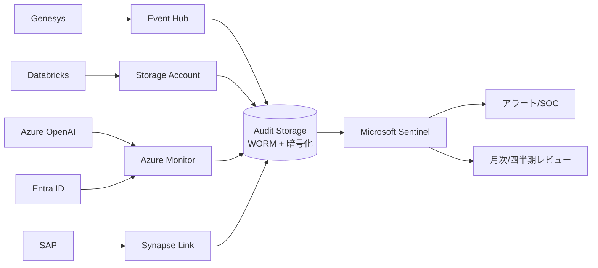

# 監査証跡設計

## 品質ゲート対応
- **GOV-AUDIT-TRAIL-001** (high): 別ストレージ保管、WORM/改ざん防止、定期レビュー

## 概要

監査証跡 (Audit Trail) は、運用上の操作・データアクセス・変更履歴を **改ざん不能** に記録するもの。
規制対象案件 (個情法・電気通信事業法・SOC2) では必須。

## いつ使うか

- 矢羽⑥ 非機能・運用 6.10 (継続的セキュリティ監査) で設計
- 矢羽② システム要件定義 (NFR-013 監査ログ) と連動
- 本番運用開始前に整備完了必須

## 設計原則 (4 原則)

### 原則 1: 別ストレージ保管
監査ログを **業務システムと物理/論理的に分離** されたストレージへ保管。
- 業務システム: Azure Subscription A
- 監査ログ: Azure Subscription B (別 Azure AD テナントまたは別サブスク + RBAC厳格化)

### 原則 2: WORM (Write Once Read Many)
書き込み後の変更不可を保証。
- Azure Blob Storage **Immutable Storage** (Time-based retention policy)
- 期間: NFR-013 に準拠 (最小1年 / 目標5年 / 卓越10年)

### 原則 3: 改ざん防止
- ハッシュチェーン (各ログエントリにこれまでのハッシュを連結)
- デジタル署名 (Azure Key Vault のキーで定期署名)
- ログ欠損検知 (連番抜け検出)

### 原則 4: 定期レビュー
- 月次: ログ取得状況確認
- 四半期: サンプルレビュー
- 年次: 監査委員会レビュー

## 監査対象 (システム別)

### Genesys Cloud CX
- ログ種類:
  - User actions (login, role change, config change)
  - Call recordings access
  - Voice bot dialogs
  - Routing rule changes
- API: Genesys Cloud Audit API
- 連携: Azure Monitor / Event Hub 経由で集約

### Databricks Lakehouse
- ログ種類:
  - Workspace audit logs (job submission, cluster creation)
  - Unity Catalog audit (table access, grant)
  - SQL warehouse query history
- 連携: Azure Storage Account + System Tables

### Azure OpenAI
- ログ種類:
  - Prompt log (Diagnostic Settings 有効化)
  - Token usage
  - Content filter triggers
- 連携: Azure Monitor

### SAP SuccessFactors
- ログ種類:
  - User access (employee data view)
  - Talent data change (skill, evaluation)
  - Permission change
- 連携: SAP Audit Trail + Azure Synapse Link

### Microsoft Entra ID
- ログ種類:
  - Sign-in logs
  - Audit logs (group/role/user changes)
  - Risky sign-ins
- 連携: Azure Monitor (Entra ID Premium 必須)

## 統合アーキテクチャ



## ログスキーマ標準

各ログエントリに含めるべき項目 (CEF/LEEF/JSON 共通):

```json
{
  "timestamp": "2026-04-30T10:00:00.000Z",
  "event_id": "EVT-uuid",
  "previous_hash": "sha256:...",
  "current_hash": "sha256:...",
  "user_id": "U-12345",
  "user_role": "OP",
  "session_id": "S-uuid",
  "source_system": "genesys",
  "action": "view_recording",
  "target_resource": "RC-67890",
  "target_classification": "極秘",
  "ip_address": "10.x.x.x",
  "user_agent": "...",
  "result": "success",
  "additional_context": {...}
}
```

`previous_hash` + `current_hash` でチェーン構築 → 改ざん検知。

## 保持期間ポリシー

| カテゴリ | 法定最低 | 推奨 | NFR水準 |
|---------|---------|------|---------|
| 個人情報アクセスログ | 1年 (個情法) | 5年 | NFR-013 目標 |
| 通話録音アクセスログ | 5年 (録音と同期間) | 録音+1年 | NFR-013 卓越=10年 |
| 認証ログ | 90日 | 1年 | NFR-013 最小 |
| 設定変更ログ | 1年 | 5年 | NFR-013 目標 |
| LLM プロンプトログ | 1年 (PIIフィルタ後) | 3年 | 別途 |

## SIEM 連携

Microsoft Sentinel (Azure 標準) を SIEM として推奨:
- ログ統合 (Genesys/Databricks/SAP/Entra ID/Azure OpenAI)
- Kusto Query Language (KQL) で柔軟検索
- 異常検知 (UEBA)
- 自動対応 (SOAR)

## 異常検知ルール (例)

| ID | ルール | 対応 |
|----|-------|------|
| ALR-001 | 深夜の大量 SELECT (録音閲覧) | SOC即時通知 |
| ALR-002 | 退職予定者のアクセス急増 (HRデータ連携) | 人事+CISO |
| ALR-003 | 権限変更申請の急増 | セキュリティ |
| ALR-004 | LLM プロンプトに PII 検出 (DLP) | AI Lead |
| ALR-005 | ログ送信途絶 (5分以上) | 即時調査 |

## 定期レビュー

### 月次
- ログ取得状況確認 (各システム × 取得率 99%以上)
- 異常検知ルール発火件数レビュー

### 四半期
- サンプルレビュー (各システム 100件抽出)
- 異常検知ルール調整 (False Positive削減)

### 年次
- 監査委員会レビュー (内部監査 + 外部監査)
- ログ保持期間ポリシー見直し
- WORM 設定再確認

## pm-blueprint 連携

| Layer | 関連 | 内容 |
|-------|------|------|
| Layer 5 暗号化_KMS設計 | 監査ログ暗号化キー管理 |
| Layer 5 リスクレジスタ | R-003 (PII漏洩) 監視 |
| Layer 5 ゼロトラスト方針 | 監査前提 |
| Layer 6 矢羽⑥ 6.10 | 継続的セキュリティ監査 (2MM) |
| Layer 7 個情法対応マトリクス | 監査ログ保持期間 |
| Layer 7 データ保持_削除戦略 | ログ削除タイミング |
| Layer 9 ランブック規約 | 監査ログ確認手順 |

## 参考

- ISO/IEC 27001 A.12.4 (Logging and Monitoring)
- NIST SP 800-92 Guide to Computer Security Log Management
- Microsoft Sentinel ドキュメント
- 既存 layer-5-risk/脅威モデリング.md
