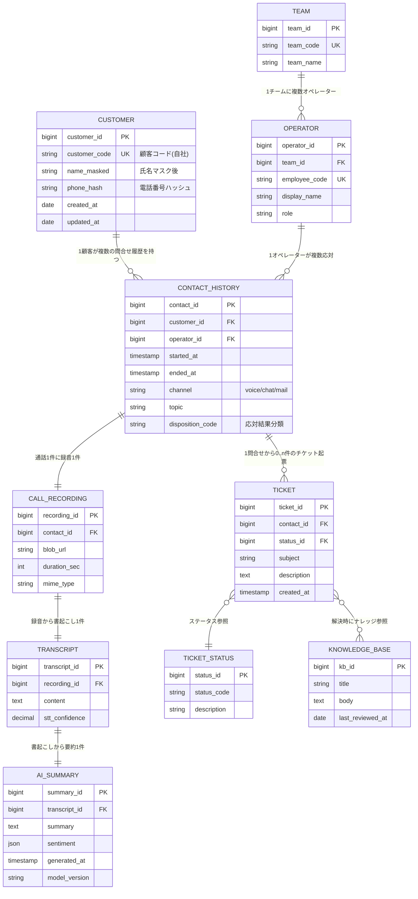
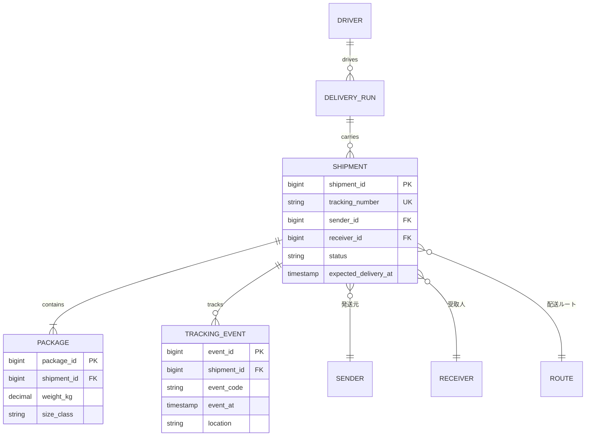
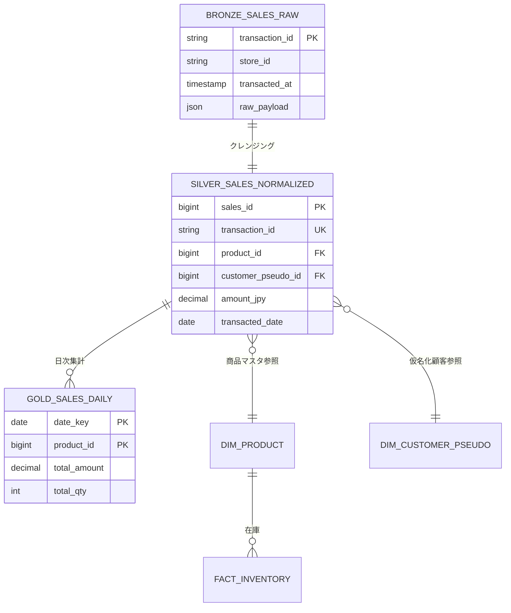

# ERD 仕様書 (Entity Relationship Diagram Specification)

> **目的:** 主要エンティティ・属性・リレーション・制約を文書化し、データモデル全体像を共有する。Mermaid erDiagram で図示し、テキストで補足する。
>
> **対応する品質評価ID:** DATA-ENTITY-001 (Critical Fail) — ERD 文書の不在
>
> **参照 pm-blueprint レイヤー:** Layer 3 (システム設計: データ層) / Layer 4 (NFR: Performance/Scalability)

## 基本情報

| 項目 | 内容 |
|------|------|
| プロジェクト名 | [埋めてください] |
| 対象システム | [埋めてください 例: 顧客サービス基盤 / 物流コア基幹] |
| 文書責任者 | [データアーキテクトリード] |
| データソース範囲 | [埋めてください] |
| 作成日 | [YYYY-MM-DD] |
| 版 | 1.0 |
| 次回見直し | [YYYY-MM-DD] |

---

## 1. ERD 概観 (Mermaid)

> **記入例 (コールセンター業界):** 通話・顧客・オペレーター・チケット・要約結果



---

## 2. エンティティ一覧

| ID | エンティティ名 | 物理名 | 説明 | 機密度分類 |
|----|--------------|-------|------|----------|
| E-001 | 顧客 | CUSTOMER | サービス利用者 | confidential |
| E-002 | 問合せ履歴 | CONTACT_HISTORY | 全チャネル横断問合せ | confidential |
| E-003 | 通話録音 | CALL_RECORDING | 音声バイナリメタ | restricted |
| E-004 | 書き起こし | TRANSCRIPT | STT 出力 | restricted |
| E-005 | AI 要約 | AI_SUMMARY | LLM 要約 | confidential |
| E-006 | チケット | TICKET | 起票管理 | confidential |
| E-007 | オペレーター | OPERATOR | 応対者マスタ | internal |
| E-008 | チーム | TEAM | 組織マスタ | internal |
| E-009 | チケットステータス | TICKET_STATUS | ステータスマスタ | internal |
| E-010 | ナレッジ | KNOWLEDGE_BASE | FAQ/SOP | internal |
| E-NNN | [埋めてください] |  |  |  |

---

## 3. エンティティ詳細

### 3.1 E-001 顧客 (CUSTOMER)

| 属性 | 物理名 | 型 | 制約 | 説明 |
|------|-------|----|------|------|
| 顧客 ID | customer_id | BIGINT | PK, NOT NULL, IDENTITY | サロゲートキー |
| 顧客コード | customer_code | VARCHAR(20) | UK, NOT NULL | 業務識別子 |
| 氏名 (マスク済) | name_masked | VARCHAR(100) | NOT NULL | 表示用部分マスク |
| 電話番号ハッシュ | phone_hash | CHAR(64) | INDEX | SHA-256(salt+phone) |
| 作成日時 | created_at | TIMESTAMP | NOT NULL, DEFAULT NOW | |
| 更新日時 | updated_at | TIMESTAMP | NOT NULL | トリガで更新 |

- **保持件数想定:** [10M 件 → 50M 件 / 10年]
- **更新頻度:** [日次バッチ + 随時更新]
- **削除ポリシー:** [契約終了から 5年経過後、論理削除→物理削除]

### 3.2 E-002 問合せ履歴 (CONTACT_HISTORY)

| 属性 | 物理名 | 型 | 制約 | 説明 |
|------|-------|----|------|------|
| 問合せ ID | contact_id | BIGINT | PK, IDENTITY | |
| 顧客 ID | customer_id | BIGINT | FK→CUSTOMER, NOT NULL | |
| オペレーター ID | operator_id | BIGINT | FK→OPERATOR, NULL | IVR放置はNULL |
| 開始日時 | started_at | TIMESTAMP | NOT NULL | |
| 終了日時 | ended_at | TIMESTAMP | NULL | 進行中はNULL |
| チャネル | channel | VARCHAR(20) | CHECK IN ('voice','chat','mail') | |
| トピック | topic | VARCHAR(200) | | |
| 応対結果分類 | disposition_code | VARCHAR(20) | FK→DISPOSITION, NULL | |

- **保持件数想定:** [埋めてください 例: 月 X 万件 × 保持月数 = 累計 Y 万件]
- **パーティション:** started_at (月パーティション)
- **クラスタリング:** customer_id

### 3.3 E-003 通話録音 (CALL_RECORDING)

| 属性 | 物理名 | 型 | 制約 | 説明 |
|------|-------|----|------|------|
| 録音 ID | recording_id | BIGINT | PK | |
| 問合せ ID | contact_id | BIGINT | FK→CONTACT_HISTORY, NOT NULL, UK | 1:1 |
| Blob URL | blob_url | VARCHAR(500) | NOT NULL | Azure Blob 参照 |
| 録音長 (秒) | duration_sec | INTEGER | CHECK >=0 | |
| メディアタイプ | mime_type | VARCHAR(50) | DEFAULT 'audio/wav' | |

- **暗号化:** AES-256 + Customer-Managed Key
- **アクセス:** RBAC 'CSAuditRole' のみ
- **保管期間:** 5年

### 3.4 E-NNN [新規エンティティのテンプレ]

| 属性 | 物理名 | 型 | 制約 | 説明 |
|------|-------|----|------|------|
| [属性名] | [physical_name] | [型] | [制約] | [説明] |

---

## 4. リレーション一覧

| ID | 親エンティティ | 子エンティティ | 関連性 | カーディナリティ | 制約 |
|----|-------------|-------------|-------|---------------|------|
| R-001 | CUSTOMER | CONTACT_HISTORY | 顧客が複数の問合せを持つ | 1:N | ON DELETE RESTRICT |
| R-002 | CONTACT_HISTORY | CALL_RECORDING | 通話 1 件に録音 1 件 | 1:1 | ON DELETE CASCADE |
| R-003 | CALL_RECORDING | TRANSCRIPT | 録音から書き起こし 1 件 | 1:1 | ON DELETE CASCADE |
| R-004 | TRANSCRIPT | AI_SUMMARY | 書き起こしから AI 要約 1 件 | 1:1 | ON DELETE CASCADE |
| R-005 | OPERATOR | CONTACT_HISTORY | オペレーターが複数応対 | 1:N | ON DELETE SET NULL |
| R-006 | TEAM | OPERATOR | チームに複数オペレーター | 1:N | ON DELETE RESTRICT |
| R-007 | CONTACT_HISTORY | TICKET | 1 問合せから 0..n チケット | 1:N | ON DELETE CASCADE |
| R-008 | TICKET_STATUS | TICKET | ステータスマスタ参照 | 1:N | ON DELETE RESTRICT |
| R-009 | TICKET | KNOWLEDGE_BASE | 多対多 (中間テーブル) | M:N | ON DELETE CASCADE (中間) |

---

## 5. 主要制約・ビジネスルール

### 5.1 一意制約 (Unique Constraints)

- CUSTOMER.customer_code は全件で一意
- OPERATOR.employee_code は全件で一意
- TEAM.team_code は全件で一意
- (CONTACT_HISTORY.contact_id, CALL_RECORDING.contact_id) は 1:1 強制

### 5.2 チェック制約 (Check Constraints)

- CONTACT_HISTORY.channel は voice/chat/mail のみ
- CALL_RECORDING.duration_sec >= 0
- CONTACT_HISTORY.ended_at >= started_at (進行中除く)

### 5.3 ビジネスルール (アプリ層で担保)

- BR-001: 同一顧客の同時進行問合せは最大 3 件
- BR-002: 通話録音は IVR で同意を取得した場合のみ生成
- BR-003: チケットの自動クローズは最終更新から 30 日経過時

---

## 6. 物流業ドメインの ERD 例



---

## 7. データ分析基盤ドメインの ERD 例 (Bronze/Silver/Gold)



---

## 8. NFR 影響と容量設計

| 項目 | 想定値 |
|------|-------|
| 主要トランザクション/秒 | [TPS X] |
| 1日あたりレコード増加 | [N M レコード/日] |
| 5年後想定容量 | [Y TB] |
| バックアップ容量 | [Z TB / RPO 5分] |
| クエリ応答 SLO | [メイン KPI クエリ <2秒] |

---

## 9. データ系譜 (Lineage)

[BI ダッシュボードまでのデータフロー要約 — 詳細は別図]

```
[ソースシステム] → [Bronze] → [Silver] → [Gold] → [BI / API]
```

---

## 10. 変更履歴

| 日付 | 版 | 変更内容 | 変更者 |
|------|----|---------|-------|
| YYYY-MM-DD | 1.0 | 初版作成 | [...] |

---

## 11. pm-blueprint 連携

- **出力レイヤー:** Layer 3 (Data Layer Design)
- **関連品質ゲート ID:**
  - DATA-ENTITY-001 (Critical) ... 本 ERD 文書の存在
  - DATA-TX-001 (Critical) ... Tx境界宣言.md との整合
  - API-IDEMPOTENCY-001 (Critical) ... OpenAPI 仕様書との整合
- **ゲート通過条件:**
  1. 主要エンティティが定義され、Mermaid erDiagram で可視化されている
  2. 全エンティティが機密度分類を持つ (データ分類台帳と整合)
  3. リレーションのカーディナリティが明示
- **連携 ADR:** スキーマ重要決定は ADR 化 (例: ADR-XXXX「録音メタの 1:1 分割設計」)
