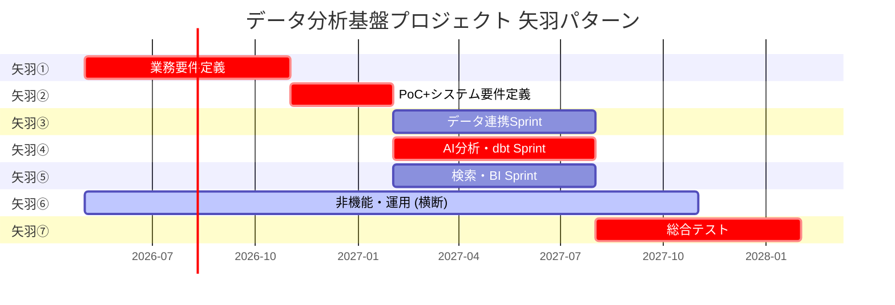

# WBS雛形 - 矢羽パターン (データ分析基盤)

> 年間1億円〜1.5億円規模、6〜8名、18ヶ月プロジェクト想定。
> L2 (矢羽) / L3 (アクティビティ) / L4 (タスク) の3階層構成。
> 合計工数: **46 人月** (並列実行により期間 18ヶ月)

## 全体構成



## WBS 詳細表

### 矢羽① 業務要件定義 (6人月 / 6ヶ月 / 直列)

| No | L2矢羽 | L3アクティビティ | L4タスク | 工数(人月) | 担当ロール | 依存 | 関連リスクID | 成果物 |
|----|-------|----------------|---------|-----------|----------|------|-------------|-------|
| 1.1.1 | ① 業務要件定義 | 現行業務ヒアリング | 主要部門 (経営/マーケ/営業/店舗) のヒアリング実施 | 0.4 | PM/BA | - | R005 | ヒアリング議事録 |
| 1.1.2 | ① | 現行業務ヒアリング | ペインポイント整理と集計 | 0.2 | BA | 1.1.1 | - | ペインポイントリスト |
| 1.1.3 | ① | 現行業務ヒアリング | 既存ダッシュボード・レポート棚卸し | 0.2 | BA | 1.1.1 | - | 既存資産台帳 |
| 1.2.1 | ① | ユースケース案策定 | ユースケースブレスト (10〜20件) | 0.3 | PM/BA/業務代表 | 1.1.2 | - | ユースケース一覧 |
| 1.2.2 | ① | ユースケース案策定 | ユースケース仕様書作成 (Use Case 2.0 slim) | 0.5 | BA | 1.2.1 | - | UC-001〜UC-0XX |
| 1.2.3 | ① | ユースケース案策定 | ステークホルダーレビュー | 0.2 | PM | 1.2.2 | - | レビュー記録 |
| 1.3.1 | ① | データ棚卸 | ソース系データスキーマ取得 | 0.3 | データエンジ | - | R001 | スキーマ一覧 |
| 1.3.2 | ① | データ棚卸 | データ品質初期評価 (欠損、鮮度) | 0.3 | データエンジ | 1.3.1 | R001 | データ品質評価書 |
| 1.4.1 | ① | IF方式の当たり付け | 候補方式比較 (API/ファイル/CDC) | 0.2 | アーキ | 1.3.2 | - | IF方式比較表 |
| 1.4.2 | ① | IF方式の当たり付け | ソース系運用チームと初期調整 | 0.2 | PM | 1.4.1 | R001 | 調整議事録 |
| 1.5.1 | ① | 分析軸・KPI整理 | 既存 KPI の集約 | 0.3 | BA | 1.1.3 | - | KPI一覧 |
| 1.5.2 | ① | 分析軸・KPI整理 | KPI定義の部門間差分特定 | 0.3 | BA | 1.5.1 | - | 差分レポート |
| 1.5.3 | ① | 分析軸・KPI整理 | 統一 KPI 仮案の作成 | 0.3 | BA | 1.5.2 | - | 統一KPI仮案 |
| 1.6.1 | ① | 機能要件概要整理 | ユースケース→機能への分解 | 0.4 | BA | 1.2.2 | - | 機能一覧 |
| 1.6.2 | ① | 機能要件概要整理 | 機能の優先度付け (MoSCoW) | 0.2 | PM/業務代表 | 1.6.1 | - | 優先度表 |
| 1.7.1 | ① | 環境準備 | 開発環境のアカウント取得、VPN 設定 | 0.3 | インフラ | - | - | 環境アクセス確認 |
| 1.7.2 | ① | 環境準備 | コラボレーションツール (Slack, Notion) 開設 | 0.2 | PM | - | - | ツール URL |
| 1.8.1 | ① | PoC計画 | PoC スコープ決定 (主要3ユースケース) | 0.3 | PM/アーキ | 1.6.2 | - | PoC計画書 |
| 1.8.2 | ① | PoC計画 | PoC 成功基準の合意 | 0.2 | PM | 1.8.1 | - | PoC成功基準書 |
| 1.8.3 | ① | PoC計画 | 矢羽①完了承認会議の準備 | 0.2 | PM | 1.8.2 | - | 承認会議資料 |

**矢羽① 小計: 6.0 人月** ✓

### 矢羽② PoC + システム要件定義 (6人月 / 3ヶ月 / 直列)

| No | L2矢羽 | L3アクティビティ | L4タスク | 工数(人月) | 担当ロール | 依存 | 関連リスクID | 成果物 |
|----|-------|----------------|---------|-----------|----------|------|-------------|-------|
| 2.1.1 | ② PoC+要件定義 | PoC環境構築 | Databricks ワークスペース作成 | 0.3 | インフラ | 1.7.1 | - | PoC環境 |
| 2.1.2 | ② | PoC環境構築 | Delta Lake 初期構成 (Bronze/Silver/Gold) | 0.4 | アーキ | 2.1.1 | - | 層構造 |
| 2.1.3 | ② | PoC環境構築 | 認証 (Entra ID) 連携 | 0.3 | インフラ | 2.1.1 | - | 認証動作確認 |
| 2.2.1 | ② | データ連携検証 | 主要ソース 1 件の取込 PoC | 0.5 | データエンジ | 2.1.2 | R001 | 取込ジョブ |
| 2.2.2 | ② | データ連携検証 | スキーマ変動検証 | 0.3 | データエンジ | 2.2.1 | R001 | 検証レポート |
| 2.3.1 | ② | LLM/AI検証 | Azure OpenAI 接続確認 | 0.3 | データサイエンス | - | - | 接続確認 |
| 2.3.2 | ② | LLM/AI検証 | サンプルデータでの分類・要約検証 | 0.5 | データサイエンス | 2.3.1 | R002 | 分類精度レポート |
| 2.3.3 | ② | LLM/AI検証 | PII混入経路の確認 | 0.2 | セキュリティ | 2.3.2 | R003 | PII検知結果 |
| 2.4.1 | ② | モデル比較検証 | dbt モデル試作 (主要5モデル) | 0.5 | データエンジ | 2.2.1 | - | dbt モデル |
| 2.4.2 | ② | モデル比較検証 | 性能ベンチマーク | 0.3 | データエンジ | 2.4.1 | - | 性能レポート |
| 2.5.1 | ② | データ統合検証 | Gold Mart 主要 2 つ試作 | 0.5 | データエンジ | 2.4.1 | - | Gold Mart 試作 |
| 2.5.2 | ② | データ統合検証 | BI ツールから参照確認 | 0.3 | BI開発 | 2.5.1 | - | ダッシュボード試作 |
| 2.6.1 | ② | 結果評価・アーキ確定 | PoC 結果ステークホルダー報告 | 0.3 | PM | 2.5.2 | - | PoC報告書 |
| 2.6.2 | ② | 結果評価・アーキ確定 | アーキテクチャ決定 (ADR) | 0.5 | アーキ | 2.6.1 | - | ADR-0001〜0005 |
| 2.6.3 | ② | 結果評価・アーキ確定 | リスクレジスタ更新 | 0.2 | PM | 2.6.1 | - | リスクレジスタ |
| 2.7.1 | ② | システム要件定義書作成 | 機能要件の詳細化 | 0.4 | BA | 2.6.2 | - | 機能要件書 |
| 2.7.2 | ② | システム要件定義書作成 | NFR (SMART-NFR) の確定 | 0.3 | アーキ | 2.6.2 | - | NFRランディングゾーン |
| 2.7.3 | ② | システム要件定義書作成 | EARS 形式の要件文章化 | 0.3 | BA | 2.7.1 | - | EARS 要件文 |
| 2.7.4 | ② | システム要件定義書作成 | 矢羽②完了承認会議 | 0.2 | PM | 2.7.3 | - | 承認議事録 |

**矢羽② 小計: 6.0 人月** ✓

### 矢羽③ データ連携Sprint (7.5人月 / 6ヶ月 / 並列・アジャイル)

| No | L2矢羽 | L3アクティビティ | L4タスク | 工数(人月) | 担当ロール | 依存 | 関連リスクID | 成果物 |
|----|-------|----------------|---------|-----------|----------|------|-------------|-------|
| 3.1.1 | ③ データ連携 | 外部連携設計 | 外部データソース IF 設計 | 0.4 | アーキ | 2.7.1 | R001 | IF 設計書 |
| 3.1.2 | ③ | 外部連携設計 | セキュリティ要件反映 | 0.3 | セキュリティ | 3.1.1 | R003 | セキュリティ設計書 |
| 3.2.1 | ③ | 外部連携開発 | 外部 API 接続モジュール開発 | 0.7 | データエンジ | 3.1.2 | R001 | 接続モジュール |
| 3.2.2 | ③ | 外部連携開発 | 接続障害時のリトライ実装 | 0.3 | データエンジ | 3.2.1 | - | リトライロジック |
| 3.2.3 | ③ | 外部連携開発 | 単体テスト | 0.3 | データエンジ | 3.2.2 | - | テスト結果 |
| 3.3.1 | ③ | データ取込パイプライン開発 | Bronze 層書込ロジック | 0.6 | データエンジ | 2.1.2 | - | 書込モジュール |
| 3.3.2 | ③ | データ取込パイプライン開発 | スキーマ進化対応 | 0.4 | データエンジ | 3.3.1 | R001 | スキーマ管理 |
| 3.3.3 | ③ | データ取込パイプライン開発 | エラーハンドリング・DLQ | 0.4 | データエンジ | 3.3.1 | - | DLQ 設計 |
| 3.4.1 | ③ | 業務データ連携設計 | POS/会員DB/EC/WiFi の IF 設計 | 0.5 | アーキ | 2.6.2 | R001 | 業務 IF 設計書 |
| 3.4.2 | ③ | 業務データ連携設計 | ソース系運用調整 (接続テスト) | 0.4 | PM | 3.4.1 | R001 | 調整結果 |
| 3.5.1 | ③ | 業務データ取込開発 | POS 連携実装 | 0.7 | データエンジ | 3.4.2 | R001 | POS 取込 |
| 3.5.2 | ③ | 業務データ取込開発 | 会員DB 連携実装 | 0.6 | データエンジ | 3.4.2 | R001, R003 | 会員DB 取込 |
| 3.5.3 | ③ | 業務データ取込開発 | EC 連携実装 | 0.5 | データエンジ | 3.4.2 | R001 | EC 取込 |
| 3.5.4 | ③ | 業務データ取込開発 | WiFi ログ取込 | 0.4 | データエンジ | 3.4.2 | - | WiFi 取込 |
| 3.6.1 | ③ | 結合テスト | 全ソース統合テスト | 0.5 | データエンジ | 3.5.4 | R004 | 結合テスト結果 |
| 3.6.2 | ③ | 結合テスト | 障害シナリオテスト | 0.5 | データエンジ/運用 | 3.6.1 | - | 障害テスト結果 |

**矢羽③ 小計: 7.5 人月** ✓

### 矢羽④ AI分析・dbt開発Sprint (8.5人月 / 6ヶ月 / 並列・アジャイル)

| No | L2矢羽 | L3アクティビティ | L4タスク | 工数(人月) | 担当ロール | 依存 | 関連リスクID | 成果物 |
|----|-------|----------------|---------|-----------|----------|------|-------------|-------|
| 4.1.1 | ④ AI分析・dbt | Bronze/Silver/Gold設計 | Bronze 層スキーマ決定 | 0.3 | データアーキ | 2.6.2 | - | Bronze スキーマ |
| 4.1.2 | ④ | Bronze/Silver/Gold設計 | Silver 層共通命名ルール策定 | 0.3 | データアーキ | 4.1.1 | - | 命名規則 |
| 4.1.3 | ④ | Bronze/Silver/Gold設計 | Gold 層 Mart 設計 | 0.4 | データアーキ | 4.1.2 | - | Mart 設計書 |
| 4.2.1 | ④ | Bronze→Silver開発 | Silver 共通変換ロジック開発 | 0.5 | データエンジ | 4.1.2 | R005 | 共通ロジック |
| 4.2.2 | ④ | Bronze→Silver開発 | POS → Silver 開発 | 0.5 | データエンジ | 4.2.1 | - | POS Silver |
| 4.2.3 | ④ | Bronze→Silver開発 | 会員DB → Silver 開発 | 0.5 | データエンジ | 4.2.1 | R003 | 会員 Silver |
| 4.2.4 | ④ | Bronze→Silver開発 | EC → Silver 開発 | 0.5 | データエンジ | 4.2.1 | - | EC Silver |
| 4.3.1 | ④ | Silver→Gold Mart開発 | 売上 Mart 開発 | 0.5 | データエンジ | 4.2.4 | - | 売上 Mart |
| 4.3.2 | ④ | Silver→Gold Mart開発 | 売上 Mart RLS 実装 | 0.3 | データエンジ | 4.3.1 | R003 | RLS ポリシー |
| 4.3.3 | ④ | Silver→Gold Mart開発 | 会員 Mart 開発 | 0.5 | データエンジ | 4.2.3 | R003 | 会員 Mart |
| 4.3.4 | ④ | Silver→Gold Mart開発 | キャンペーン Mart 開発 | 0.5 | データエンジ | 4.3.1, 4.3.3 | - | キャンペーン Mart |
| 4.3.5 | ④ | Silver→Gold Mart開発 | 統合 KPI Mart 開発 | 0.5 | データエンジ | 4.3.4 | - | 統合 KPI Mart |
| 4.4.1 | ④ | 分類マスタ設計 | 商品カテゴリマスタ | 0.2 | BA | 1.5.3 | - | 商品カテゴリマスタ |
| 4.4.2 | ④ | 分類マスタ設計 | セグメント定義 | 0.3 | BA | 1.5.3 | - | セグメント定義書 |
| 4.5.1 | ④ | AI分析パイプライン開発 | LLM 接続・プロンプト設計 | 0.5 | データサイエンス | 2.3.3 | R002, R003 | プロンプトテンプレ |
| 4.5.2 | ④ | AI分析パイプライン開発 | 分類パイプライン実装 | 0.8 | データサイエンス | 4.5.1 | R002 | 分類パイプライン |
| 4.5.3 | ④ | AI分析パイプライン開発 | 要約パイプライン実装 | 0.5 | データサイエンス | 4.5.1 | R002 | 要約パイプライン |
| 4.5.4 | ④ | AI分析パイプライン開発 | テスト・アライメント | 0.2 | データサイエンス | 4.5.3 | R007 | アライメント結果 |
| 4.6.1 | ④ | チューニング | コスト最適化 (LLM) | 0.3 | データサイエンス | 4.5.4 | R002 | 最適化レポート |
| 4.6.2 | ④ | チューニング | 性能チューニング (dbt) | 0.4 | データエンジ | 4.3.5 | - | 性能レポート |
| 4.7.1 | ④ | マスタ最終調整 | 業務部門レビュー反映 | 0.3 | BA | 4.4.2 | - | 更新マスタ |
| 4.7.2 | ④ | マスタ最終調整 | ドキュメント更新 | 0.2 | BA | 4.7.1 | - | 仕様書更新 |

**矢羽④ 小計: 8.5 人月** ✓

### 矢羽⑤ 検索・BI開発Sprint (7人月 / 6ヶ月 / 並列・アジャイル)

| No | L2矢羽 | L3アクティビティ | L4タスク | 工数(人月) | 担当ロール | 依存 | 関連リスクID | 成果物 |
|----|-------|----------------|---------|-----------|----------|------|-------------|-------|
| 5.1.1 | ⑤ 検索・BI | Semantic Model設計 | Gold Mart から Semantic Layer 定義 | 0.5 | BI開発 | 4.3.5 | - | Semantic Model |
| 5.1.2 | ⑤ | Semantic Model設計 | メトリクス辞書整備 | 0.3 | BA | 5.1.1 | - | メトリクス辞書 |
| 5.1.3 | ⑤ | Semantic Model設計 | RLS 反映 | 0.2 | BI開発 | 5.1.1 | R003 | RLS 設定 |
| 5.2.1 | ⑤ | 検索インデックス構築 | 検索対象データの選定 | 0.2 | BA | - | - | 検索対象リスト |
| 5.2.2 | ⑤ | 検索インデックス構築 | Vector Store セットアップ | 0.3 | データエンジ | 5.2.1 | - | Vector Store |
| 5.2.3 | ⑤ | 検索インデックス構築 | Embedding パイプライン | 0.4 | データサイエンス | 5.2.2 | R002 | Embedding Pipeline |
| 5.3.1 | ⑤ | Text2SQL開発 | Text2SQL プロンプト設計 | 0.4 | データサイエンス | 5.1.2 | R012 | プロンプトテンプレ |
| 5.3.2 | ⑤ | Text2SQL開発 | Text2SQL 検証と制限 | 0.4 | データサイエンス | 5.3.1 | R003, R012 | 検証レポート |
| 5.4.1 | ⑤ | ダッシュボード開発 | 経営層向けダッシュボード | 0.6 | BI開発 | 5.1.1 | - | 経営ダッシュボード |
| 5.4.2 | ⑤ | ダッシュボード開発 | マーケ部向けダッシュボード | 0.6 | BI開発 | 5.1.1 | - | マーケダッシュボード |
| 5.4.3 | ⑤ | ダッシュボード開発 | 店舗運営向けダッシュボード | 0.5 | BI開発 | 5.1.1 | - | 店舗ダッシュボード |
| 5.5.1 | ⑤ | エクスポート機能 | CSV/Excel 出力機能 | 0.3 | BI開発 | 5.4.3 | R003 | エクスポート機能 |
| 5.5.2 | ⑤ | エクスポート機能 | 同意済みフィルタ | 0.2 | BI開発 | 5.5.1 | R003 | 同意フィルタ |
| 5.6.1 | ⑤ | チューニング | ダッシュボード性能最適化 | 0.5 | BI開発 | 5.4.3 | - | 性能レポート |
| 5.6.2 | ⑤ | チューニング | 検索精度改善 | 0.3 | データサイエンス | 5.2.3 | - | 精度レポート |
| 5.7.1 | ⑤ | UI改修 | ステークホルダーレビュー反映 | 0.3 | BI開発 | 5.6.1 | - | UI 更新 |
| 5.7.2 | ⑤ | UI改修 | アクセシビリティ対応 | 0.2 | BI開発 | 5.7.1 | - | アクセシビリティ報告 |

**矢羽⑤ 小計: 7.0 人月** ✓

### 矢羽⑥ 非機能・運用 (6人月 / 12ヶ月 / 横断)

| No | L2矢羽 | L3アクティビティ | L4タスク | 工数(人月) | 担当ロール | 依存 | 関連リスクID | 成果物 |
|----|-------|----------------|---------|-----------|----------|------|-------------|-------|
| 6.1.1 | ⑥ 非機能・運用 | 非機能要件定義 | NFR ランディングゾーン確定 | 0.3 | アーキ | 2.7.2 | - | NFR 一覧 |
| 6.1.2 | ⑥ | 非機能要件定義 | セキュリティポリシー策定 | 0.3 | セキュリティ | 6.1.1 | R003 | セキュリティポリシー |
| 6.2.1 | ⑥ | IaC 設計・実装 | Terraform 初期構成 | 0.5 | インフラ | 2.1.1 | - | Terraform コード |
| 6.2.2 | ⑥ | IaC 設計・実装 | 開発・STG・本番環境分離 | 0.4 | インフラ | 6.2.1 | - | 環境分離構成 |
| 6.3.1 | ⑥ | CI/CD 構築 | dbt CI/CD パイプライン | 0.4 | データエンジ | 4.2.1 | - | CI/CD パイプライン |
| 6.3.2 | ⑥ | CI/CD 構築 | BI アーティファクト自動デプロイ | 0.3 | BI開発 | 5.1.1 | - | BI CI/CD |
| 6.4.1 | ⑥ | 監視ダッシュボード | システム監視設定 | 0.3 | 運用 | 6.2.2 | - | 監視ダッシュボード |
| 6.4.2 | ⑥ | 監視ダッシュボード | データ品質モニタリング | 0.3 | データエンジ | 4.3.5 | R001 | 品質モニタ |
| 6.5.1 | ⑥ | アラート設定 | 重要度別アラート設計 | 0.3 | 運用 | 6.4.1 | - | アラート定義 |
| 6.5.2 | ⑥ | アラート設定 | オンコール体制構築 | 0.2 | PM/運用 | 6.5.1 | - | オンコール手順 |
| 6.6.1 | ⑥ | 障害対応フロー | 障害対応ランブック作成 | 0.4 | 運用 | 6.4.2 | - | ランブック |
| 6.6.2 | ⑥ | 障害対応フロー | 障害対応リハーサル | 0.2 | 運用 | 6.6.1 | - | リハーサル記録 |
| 6.7.1 | ⑥ | 運用手順書整備 | 運用手順書作成 (全パイプライン) | 0.5 | 運用 | 6.3.2 | - | 運用手順書 |
| 6.7.2 | ⑥ | 運用手順書整備 | バックアップ・リストア手順 | 0.3 | 運用 | 6.2.2 | - | BCP 手順 |
| 6.8.1 | ⑥ | ハンズオン | 経営層向け利用者研修 | 0.2 | BA | 5.4.1 | - | 研修資料 |
| 6.8.2 | ⑥ | ハンズオン | マーケ部向けハンズオン | 0.3 | BA/BI開発 | 5.4.2 | - | ハンズオン実施 |
| 6.8.3 | ⑥ | ハンズオン | 店舗運営向けハンズオン | 0.3 | BA/BI開発 | 5.4.3 | - | ハンズオン実施 |
| 6.9.1 | ⑥ | 展開計画策定 | パイロット展開計画 | 0.2 | PM | 6.8.3 | - | 展開計画書 |
| 6.9.2 | ⑥ | 展開計画策定 | 全面展開計画 | 0.3 | PM | 6.9.1 | - | 全面展開計画書 |

**矢羽⑥ 小計: 6.0 人月** ✓

### 矢羽⑦ 総合テスト・パイロット展開 (5人月 / 6ヶ月 / 直列)

| No | L2矢羽 | L3アクティビティ | L4タスク | 工数(人月) | 担当ロール | 依存 | 関連リスクID | 成果物 |
|----|-------|----------------|---------|-----------|----------|------|-------------|-------|
| 7.1.1 | ⑦ 総合テスト | テスト計画 | テスト計画書作成 | 0.3 | QA | 4.7.2, 5.7.2 | - | テスト計画書 |
| 7.1.2 | ⑦ | テスト計画 | テストケース作成 | 0.4 | QA | 7.1.1 | - | テストケース |
| 7.2.1 | ⑦ | 結合テスト | End-to-End テスト実施 | 0.5 | QA | 7.1.2 | R004 | E2E 結果 |
| 7.2.2 | ⑦ | 結合テスト | データ整合性テスト | 0.3 | QA | 7.2.1 | R001 | 整合性レポート |
| 7.3.1 | ⑦ | 総合テスト・性能テスト | 負荷テスト | 0.4 | QA/インフラ | 7.2.2 | - | 負荷テスト結果 |
| 7.3.2 | ⑦ | 総合テスト・性能テスト | セキュリティテスト | 0.3 | セキュリティ | 7.2.2 | R003 | セキュリティレポート |
| 7.4.1 | ⑦ | UAT | UAT 計画書 | 0.2 | PM | 7.3.2 | - | UAT 計画 |
| 7.4.2 | ⑦ | UAT | 業務部門による UAT 実施 | 0.4 | 業務代表 | 7.4.1 | - | UAT 結果 |
| 7.4.3 | ⑦ | UAT | UAT 指摘の修正と再テスト | 0.4 | 全チーム | 7.4.2 | - | 修正版 |
| 7.5.1 | ⑦ | 本番移行リハーサル | 本番移行手順書 | 0.3 | 運用 | 7.4.3 | - | 移行手順書 |
| 7.5.2 | ⑦ | 本番移行リハーサル | リハーサル実施 | 0.3 | 全チーム | 7.5.1 | - | リハーサル結果 |
| 7.6.1 | ⑦ | パイロットリリース | 本番リリース作業 | 0.3 | 全チーム | 7.5.2 | - | 本番稼働 |
| 7.6.2 | ⑦ | パイロットリリース | パイロット期間監視 (1ヶ月) | 0.3 | 運用 | 7.6.1 | - | 監視記録 |
| 7.7.1 | ⑦ | リリース判定・振り返り | 成功基準との照合 | 0.2 | PM | 7.6.2 | - | 成果報告書 |
| 7.7.2 | ⑦ | リリース判定・振り返り | プロジェクト振り返り (レトロ) | 0.2 | 全員 | 7.7.1 | - | レトロ記録 |
| 7.7.3 | ⑦ | リリース判定・振り返り | 最終報告 (経営層へ) | 0.2 | PM | 7.7.2 | - | 最終報告書 |

**矢羽⑦ 小計: 5.0 人月** ✓

---

## 全体工数集計

| 矢羽 | 工数 (人月) | 期間 (ヶ月) | 特性 |
|------|------------|------------|------|
| ① 業務要件定義 | 6.0 | 6 | 直列 |
| ② PoC+システム要件定義 | 6.0 | 3 | 直列 |
| ③ データ連携Sprint | 7.5 | 6 | 並列 |
| ④ AI分析・dbt Sprint | 8.5 | 6 | 並列 |
| ⑤ 検索・BI Sprint | 7.0 | 6 | 並列 |
| ⑥ 非機能・運用 | 6.0 | 12 | 横断 |
| ⑦ 総合テスト・パイロット | 5.0 | 6 | 直列 |
| **合計** | **46.0 人月** | **18ヶ月 (並列含む)** | |

## ロール別工数集計

| ロール | 工数 (人月) |
|-------|-----------|
| PM | 2.9 |
| BA (ビジネスアナリスト) | 5.8 |
| アーキ | 4.5 |
| データエンジニア | 14.2 |
| データサイエンティスト | 4.3 |
| BI 開発 | 5.3 |
| インフラ | 2.4 |
| 運用 | 3.5 |
| セキュリティ | 1.4 |
| QA | 1.7 |
| **合計** | **46.0** |

*上記は全 L4 タスクから各ロールの工数を集計した参考値*

## Sprint 内部構成 (矢羽③④⑤)

並列 Sprint は共通のリズム:

- **Sprint 期間**: 2 週間
- **Sprint 数**: 各 13 Sprint (6ヶ月 = 26週 / 2週)
- **セレモニー**:
  - Sprint Planning: Sprint 開始日 (2 時間)
  - Daily Standup: 毎日 15 分
  - Sprint Review: Sprint 終了日 (1 時間、3 Sprint合同 2 時間)
  - Retrospective: Sprint 終了日 (1 時間)
  - Sprint of Sprints (PO 同期): 週 1 回 30 分

## 依存関係の明示

```
矢羽① ─── 矢羽② ─┬── 矢羽③ ─┐
                  ├── 矢羽④ ─┼── 矢羽⑦
                  └── 矢羽⑤ ─┘
                                  ↑
矢羽⑥ ─────────────────────────── (横断)
```

---

最終更新: [YYYY-MM-DD]
次回見直し: 矢羽①完了時
